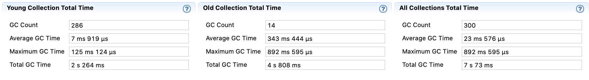

# Migration Tool 3.12 <-> 4.0/4.1

## Background
### Description
This document outlines the solution for migrating user data from a running 3.12 cluster to a 4.0 or 4.1 cluster and vice-versa. For now, support for migrating to and from Hazelcast 4.2 is not planned. Ideally, we would like to migrate data without any downtime as most customers want to avoid downtime or have some kind of "always-on" requirement.

**:exclamation: Caveats and non-goals**

- the current design DOES NOT take into account migrating clients. We assume that the user will have to adapt their code to use 4.0 clients, shut down 3.x clients pointing to the 3.x cluster and start the new 4.0 clients connecting to the 4.0 cluster. We will outline this solution in [Client Migration](#client-migration)
- we DO NOT provide any way to avoid recompiling user code, be it code using members or client instances. We only migrate member data and do not provide any 3.x compatible API on a 4.x member or client.
- here we outline a migration path from a HZ 3.12 cluster to a 4.0/4.1 cluster, not from any previous 3.x versions and not to any future 4.2+ version
- we will not constraint the solution in such a way that it should support OS users. OS users don't even have access to rolling upgrade.

See also [Limitations and known issues](#limitations-and-known-issues)

**Terminology**

| Term | Definition | 
|---|---|
|WAN event| A container object describing data mutation, for instance, a map update, cache remove, etc.|
|WAN publisher|	A sink for WAN events and implementation of WanPublisher interface. A user can implement a custom WAN publisher to publish to any non-HZ system.  An example of a custom WAN publisher would be code serializing and storing WAN events into a Kafka topic or a JMS queue. Hazelcast EE provides an out-of-the-box implementation for replicating WAN events to a Hazelcast cluster with the same major version. As such, any user wanting to use our built-in WAN replication needs to configure the instance to use our built-in implementation of WAN publisher. WAN publisher code runs on the partition thread so it should be efficient, not block, be tolerant to faults, etc. In the context of this feature, some solutions might involve a custom WAN publisher but ultimately, these were rejected. We only provide a definition here as a basis when discussing these approaches. Please see the design section for more details.|
|WAN consumer|A user implementation of the WanConsumer interface. In simple terms, this is a piece of user code which will be initialised on HZ node startup. This gives it the ability to schedule itself to run periodically and poll for WAN events. For instance, it may periodically query the Kafka topic or JMS queue mentioned under "WAN publisher". Hazelcast doesn't provide any out-of-the-box implementation of a WAN consumer. Instead, we rely on our internal operation system for our built-in WAN replication. As such, no additional config is needed on the receiver cluster for our WAN replication and a custom WAN consumer is only needed in case of custom replication (e.g. the Kafka/JMS example). In the context of this feature, some solutions might involve a custom WAN consumer but ultimately, these were rejected. We only provide a definition here as a basis when discussing these approaches. Please see the design section for more details.|

## Functional Design
### Summary of Functionality

The user will be able to migrate data from a running 3.12 cluster from and to a 4.0/4.1 cluster. For concrete migration scenarios, you can skip ahead to [Example migration scenarios](#example-migration-scenarios).

## Technical Design
When it comes to migrating cluster data, there are several approaches that come to mind. First, we list them and then we will eliminate approaches based on various restrictions and downsides.

1. Migrating data using Hot Restart (not doing)
2. Migrating data by using Rolling Upgrade (not doing)
3. Migrating data by using custom WAN replication (not doing)
4. Migrating data by running 3.12 and 4.0 member in the same JVM (not doing)
5. Migrating data by using some newly-created tool which reads from the 3.12 cluster and inserts data into a 4.0 cluster (not doing)
6. Migrating data by using our built-in WAN replication (chosen option)

**Migrating data using Hot Restart (not doing)**

This approach sounds rather reasonable and does not require lots of new code. The issues with this approach is that we have changed the serialized format as well as class and factory IDs of some classes in 4.0. For instance, the serialized format of String changed. This means, we will at least need to copy parts of the 3.12 serialization service to be able to read 3.12 HR data.

On the other hand, a big downside of this approach is that it requires downtime. As it can be seen, almost all customers want to avoid downtime. Because of this, we will not pursue this approach.

**Migrating data using Rolling upgrade (not doing)**

This is by far the most complex solution of all of the mentioned above. Lots of internals changed in 4.0, from serialization code, operations and algorithms for cluster membership management. It is almost impossible to now run a 4.0 member in a 3.12 cluster and expect for everything to function normally. Although this approach would allow seamless migration for all data structures, it will also require the most implementation and testing effort. Because of this, we will not pursue this approach.

**Migrating data using custom WAN replication (not doing)**

Here we would need to implement a custom [WAN publisher](https://github.com/hazelcast/hazelcast/blob/97ff57ba92dc1fbfa77720885e7db40757999080/hazelcast/src/main/java/com/hazelcast/wan/WanPublisher.java) and custom [WAN consumer](https://github.com/hazelcast/hazelcast/blob/97ff57ba92dc1fbfa77720885e7db40757999080/hazelcast/src/main/java/com/hazelcast/wan/WanConsumer.java). Since serialization format changed between 3.x and 4.0 and TCP/IP bind mechanism changed, we would need to switch to some third, shared, serialized format (java serialization, [Avro](https://avro.apache.org/), [Protobuf](https://developers.google.com/protocol-buffers), ...) and would need to use a custom transport mechanism ([Aeron](https://github.com/real-logic/aeron), [Netty](https://netty.io/)). The upside of this approach is that we can probably achieve very good performance but this approach has many drawbacks which will cause us to abandon it:

- new libraries and concepts both for the developer of this migration tool, the maintainer and the user using it. This will require lots of time getting familiar with the implementation details for everyone, whilst they are already familiar with the HZ concepts and settings.
- it will probably introduce lots of new configuration and may even require many code changes on the user side. For instance, if we switch to some new serialization library, the user might have to annotate their classes or write schemas for their domain objects. Also, the new transport libraries might have settings for buffers, ports, etc.
- The newly introduced libraries might not support all HZ features that the user is expecting, or they might require new ways of configuration (e.g. how to set up a secure connection for transmitting data between clusters)

**Migrating data by running 3.12 and 4.0 member in the same JVM (not doing)**

Another approach might be that we run 3.12 members alongside 4.0 members in the same JVM and connect them somehow, either with a custom WAN publisher or some other means of holding references to both instances. We will not pursue this approach because we anticipate lots of issues with classloading and it might be very tricky to get everything right when sharing references to domain objects between classloaders. Also, we would have to run at least two instances in the same JVM, thus losing any kind of isolation, increasing GC pressure, being susceptible to a JVM crash of both instances and so on.  

**Migrating data by using some newly-created tool which reads from the 3.12 cluster and inserts data into a 4.0 cluster (not doing)**

For instance, we might use jet and create some migration tool. Or, create a standalone app which will read all of the 3.12 data and insert it into 4.0. This is a reasonable approach but the issue is that it is one-off - once the migration finishes, the data in the 3.12 cluster might be mutated and this will not be copied to the 4.0 cluster.

Also, we assume that this tool will connect to both clusters via means of two clients running in the same JVM. Here, we again face challenges around classloading and on top of this, this tool will probably not be very efficient.

**Migrating data using our built-in WAN replication (chosen option)** 

Implementation PRs:
- 4.0.z->3.12 replication: https://github.com/hazelcast/hazelcast/pull/16972, https://github.com/hazelcast/hazelcast-enterprise/pull/3597
- 3.12->4.0.z replication: https://github.com/hazelcast/hazelcast/pull/16887, https://github.com/hazelcast/hazelcast-enterprise/pull/3578

In short, this solution boils down to simply copying code from 3.12 to 4.0/4.1 and vice versa:
- serialization code and class definitions that have changed (`String`, `BigInteger`, WAN classes transmitted between clusters...)
- TCP/IP bind mechanism
- WAN event processing code

The benefits of this approach:
- it gives a nice tradeoff between capabilities and implementation effort. Users will be able to migrate IMap and ICache data using WAN replication in the same way they are already using WAN replication to replicate between clusters of the same major version
- the user can use all Hazelcast features and configuration they are already used to with WAN replication (e.g. setting up HTTPs)
- the code is basically already very well-tested so what matters is only how it's integrated. We limit the amount of code which is copied to what is necessary and no more
- the client-side of the connection (e.g. source cluster) does not know it's connecting to an incompatible member

The downsides:
- WAN replication only supports `IMap` and `ICache`. Also, WAN sync which will greatly help in migrating the data, is not supported for `ICache` (see [Future improvements](#future-improvements)).

The solution is analogous both on 3.12 and 4.0 side so we will outline the solution here only for the 3.12->4.0/4.1 replication, which is located in the 4.0 codebase. When considering the 4.0/4.1->3.12 replication, you may supplant the 4.0/4.1 and 4.x versions with 3.12 and 3.x in the design description below. 

At this point, we also need to distinguish between different "types" of members, both for 3.12 and 4.0/4.1. We introduce two types of members: "migration" and "plain" members. The "migration" members are the ones which will contain the bulk of the compatibility code and will be able to accept connections and packets from members of a different major version. They will use more memory, have higher GC pressure and CPU usage in certain scenarios, all to be able to process messages from two different major versions. These members will also be released as private releases to the customers wanting to migrate between 3.12 and 4.0/4.1. On the other hand, "plain" members will be the regular public releases with a minimal amount of compatibility code. To be exact, these will be public Hazelcast releases of any 3.12 patch version and from 4.0.2 onward. The "plain" members will not be able to accept connections and process messages from members of another major version but the user might combine "plain" and "migration" members to form a single cluster.

We will now outline the design of the "migration" member, since almost all of the compatibility code is located on these members. Only a small fraction of the code is also located on the "plain" members and we will specifically mention where this is so. 

The first change needs to be introduced on the networking layer and this is the only change which is shared by both the "migration" and the "plain" members. We need to introduce a new `Packet` flag:

```java
    /**
     * Marks a packet as sent by a 4.x member
     */
    public static final int FLAG_4_0 = 1 << 7;
```

This flag on the `Packet` allow us to determine if a packet was sent by a 4.0/4.1 member without inspecting the contents of the packet and deserializing it. Without this flag there is no way how to distinguish between a packet sent by a 3.12 member and a 4.0/4.1 member and thus no way of knowing how to deserialize and interpret the packet. 

We determine if the packet was sent by a member of the other version by checking for the absence of the `FLAG_4_0` flag. If the `FLAG_4_0` is not set, we assume that the packet was sent by a 3.x member. This lifts the restriction from the source 3.x cluster and now any 3.12.x member can replicate to 4.0/4.1. All members in the 4.0/4.1 cluster must now set the `FLAG_4_0` when communicating with the "migration" members and that means that the user must not run a cluster with any "migration" member and "plain" members of versions 4.0-GA, 4.0.1 and 4.2+ (during rolling upgrade). 

Next, we need to introduce new packet types:

```java
public enum Type {
    ...
    /**
     * Type reserved for compatibility (3.x) bind messages. The appropriate
     * type conversion will happen in {@link #fromFlags(int, boolean)}.
     * <p>
     * {@code ordinal = 4}
     */
    COMPATIBILITY_BIND_MESSAGE(4),
    /**
     * Type reserved for compatibility (3.x) extended bind messages. The appropriate
     * type conversion will happen in {@link #fromFlags(int, boolean)}.
     * <p>
     * {@code ordinal = 5}
     */
    COMPATIBILITY_EXTENDED_BIND(5);
    ...
}
```

These packet types correspond to the two TCP/IP bind mechanism classes that are sent by the 3.12 member: `com.hazelcast.internal.cluster.impl.BindMessage` and `com.hazelcast.internal.cluster.impl.ExtendedBindMessage`. Hazelcast 3.12 members send both bind messages while Hazelcast 4.0 sends only the `ExtendedBindMessage` (renamed to `com.hazelcast.internal.cluster.impl.BindMessage`). We will then ignore the 3.12 `BindMessage` on the 4.0/4.1 "migration" member and only process the `ExtendedBindMessage`. Analogous, the 4.0/4.1 member only sends out the `BindMessage` (equivalent to the 3.12 `ExtendedBindMessage`) back to the 3.12 members.  
 
Once we have the appropriate packet flag and the packet types, we need to copy the rest of the TCP/IP bind mechanism which is mostly concentrated in the `BindHandler`, `BindRequest`, `BindMessage` and `ExtendedBindMessage` classes. The TCP/IP endpoint manager will now be able to use the packet flags and the packet types to deserialize and process the bind messages, thus establishing a connection between the two members of different major versions.

To deserialize packets sent by members of two different major versions, the "migration" member needs to instantiate and hold references to two serialization services - one for each major version. We call the serialization service which is responsible for deserializing data sent by the other major version the "compatibility" serialization service. To deserialize data sent by members of another major version, we need to copy some class definitions which have been added, removed or changed in the other major version. We try to avoid copying class definitions and share as many class definitions between two serialization services as possible. This includes class definitions which haven't changed at all and class definitions for which only class IDs have changed. Unfortunately, classes which changed more than just class IDs, that changed the way they serialize data they contain or which contain references to other non-primitive classes which might have changed become too complicated to share between serialization services and simply having two distinct definitions becomes the simpler option, both less error-prone and more maintainable.

Below is an example of a class where only the class ID changed. We avoid copying so we can share the definition between the two serialization services.

```java
public class ArrayListStreamSerializer<E> extends AbstractCollectionStreamSerializer<ArrayList<E>> {

    /** Determines if ser-de should conform the 3.x format */
    private final boolean isCompatibility;

    public ArrayListStreamSerializer(boolean isCompatibility) {
        this.isCompatibility = isCompatibility;
    }

    @Override
    public int getTypeId() {
        return isCompatibility
                ? CompatibilitySerializationConstants.JAVA_DEFAULT_TYPE_ARRAY_LIST
                : SerializationConstants.JAVA_DEFAULT_TYPE_ARRAY_LIST;
    }

    @Override
    public ArrayList<E> read(ObjectDataInput in) throws IOException {
        int size = in.readInt();

        ArrayList<E> collection = new ArrayList<>(size);

        return deserializeEntries(in, size, collection);
    }
}
```

On the other hand, most of WAN classes changed significantly so the simpler option is copying them. An example of such class is `CompatibilityWanEventContainerOperation` which is a copy of the `WanOperation` from 3.12.

Once the connection has been established based on the copied bind mechanism, the packet flags and the packet type, we can start sending operations between the two members of different major versions. As mentioned above, since we are now able to mimic the serialization service of another major version, the source cluster can simply send operations and WAN events without knowing that the recipient is of another major version. Based on the packet flags, we will always choose the appropriate serialization service to deserialize and run the operation.

Once we deserialize an operation which was sent by a member from another major version, we must try to reuse the same code path as it would be used if the operation was sent from a member of the same major version. This way, we can avoid copying more than just the class definitions and the compatibility code can be limited to only the "migration" members. Members not receiving connections and operations from a member of another major version ("plain" members) might not be aware that the entries which have been replicated are from a cluster of another major version. This approach further decreases the amount of code we need to copy between the major versions, the amount of code we need to test and maintain. In concrete terms, this means that WAN events which have been received from another major version are "transformed" or "translated" into WAN events or merging entries in the same format as they would be if they were sent by a cluster of the same major version, before being sent to the partition owner for the entry to be applied or before putting back the event in the WAN queues for WAN event forwarding. Most of this translation is done inside `CompatibilityWanEnterpriseMapSupportingService` and `CompatibilityWanCacheSupportingService` and we can see such an example below:

```java
    private void handleUpdateEvent(CompatibilityWanEnterpriseMapAddOrUpdateEvent event,
                                   WanAcknowledgeType acknowledgeType) {
        ...
        MapMergingEntryImpl<Object, Object> mergingEntry = convertToMergingEntry(event.getEntryView());

        final Operation operation = operationProvider.createMergeOperation(
                mapName, mergingEntry, check4xCompatibleMergePolicy(mergePolicy), true);

        InternalCompletableFuture<?> future = invokeOnPartition(mergingEntry.getRawKey(), operation);
        if (future != null && acknowledgeType == WanAcknowledgeType.ACK_ON_OPERATION_COMPLETE) {
            future.joinInternal();
        }
    }

    /**
     * Converts a compatibility 3.x WAN entry view to a 4.x merging entry for merge operations.
     *
     * @param entryView the compatibility 3.x WAN entry view
     * @return the merging entry
     */
    private MapMergingEntryImpl<Object, Object> convertToMergingEntry(CompatibilityWanMapEntryView<Data, Data> entryView) {
        Data key = serializationService.toData(compatibilitySerializationService.toObject(entryView.getKey()));
        Data value = serializationService.toData(compatibilitySerializationService.toObject(entryView.getValue()));
        return createMergingEntry(serializationService, key, value, entryView);
    }
```

An important detail is that we need to deserialize and serialize every key and every value received by a member of another major version before applying the change on the `IMap`. The reason for that is that, since the serialized format of some classes changed between major versions (including some primitives) and since `IMap` uses the serialized format of the keys to store and compare entries, it might happen that we end up with two entries in the `IMap` for entries with the same key, one which was added by invoking something like `map.put` on the target cluster and another which was received by WAN. In theory, we might avoid this deserialization/re-serialization process if we knew that the instance was of a class for which the serialized format hasn't changed between major versions but this is quite error-prone. We would need to check the class ID of the serialized instance as well as the class IDs of the whole object tree if the instance was a non-primitive class.

In summary, we have copied enough code and ensured that members of different major versions can connect to each other, send WAN operations and WAN events, perform WAN sync as well as use merkle trees. By using merkle trees and WAN, the user can encounter a known issue that is described under [Limitations and known issues](#limitations-and-known-issues). Everything except for these functionalities is out of scope for the migration tool.

### Variants of the chosen approach that were abandoned

As outlined above, we chose to add the compatibility code on the passive/receiving/target cluster. The cluster is then able to process messages sent by a member of another major version. Another approach would be if we implemented the compatibility code on the active/sending/source cluster. We assume that the user would then configure the WAN publisher with some property like this:

```xml
<wan-publisher ...>
    <properties>
        ...
        <property name="serialized.format">4.0</property>
        ...
    </properties>
</wan-publisher>
``` 
That essentially means that the publisher is aware of the target cluster version. Unfortunately this solution quickly became cost-prohibitive:
- IMap entries (keys and values) are often kept in their serialized format from as soon as the user supplies them to the point when they are inserted into the record store. They are also not deserialized and serialized when invoking the WAN publishers and inserting into the WAN queues and the reference to a serialized `Data` instance is often shared, except for `NATIVE` format. If we wanted to make the source cluster publish events in the format of the target cluster, we would most probably need to deserialize and re-serialize objects in performance-critical sections such as `map.put` operations, which increases GC pressure and decreases the performance of IMap
- WAN queue will no longer be homogenous - they might contain events in the 3.12 format and they might contain events in the 4.0/4.1 format. This complicates the cluster migration and replication mechanism.

We may avoid these issues above by delaying the translation of WAN events into a format compatible with the target cluster to a later stage - not during the actual `IMap` operation but after the event has been dequeued from the WAN queues by the WAN replication thread and before it is actually sent to the target cluster. Unfortunately, this brings in other problems: 
- even if we delay translating between 3.12 and 4.0/4.1 formats, this will complicate the WAN replication implementation and will again increase the GC pressure
- by delaying the translation of WAN event formats, we basically force each publisher to translate the event for itself and make sharing WAN events of the same format impossible. If a 3.12 cluster is replicating to two 4.0/4.1 clusters, each of the 4.0/4.1 WAN publishers will have to do the 3.12->4.0/4.1 translation separately and keep separate instances of basically the same WAN event 

We have also considered an additional approach where the user would configure a separate port to accept connections from members of a different major version. In other words, incoming connections from members of different major versions would be strictly separated by port. Here's an example of the XML configuration for something like this:
```xml
    <advanced-network enabled="true">
        ...
        <legacy-server-socket-endpoint-config name="wan-server-socket-config">
            <port>9000</port>
        </legacy-server-socket-endpoint-config>
        ...
    </advanced-network>
```
In the end, we decided not to pursue this approach because the information about the port and socket is not available when processing `Packet`s and `Operation`s and propagating this information would lead to more tight coupling between the networking and other layers inside the codebase.

### Benchmark results

Benchmark code is here: 

https://github.com/hazelcast/internal-benchmarks/tree/master/sim-migration-tool
https://github.com/hazelcast/internal-benchmarks/tree/master/sim-migration-tool-3.12

To run the benchmarks, you will probably need to build the 4.0.2-migration artifact locally to your local maven repo since it is not available on any public maven repository.

To view the effects of the compatibility code, we compare processing a 3.12 WAN event batch (`com.hazelcast.enterprise.wan.BatchWanReplicationEvent`) on a "plain" 3.12 member with processing on a 4.0-migration member. The batch size is always 500, the key for all entries is an integer while the value size varies between an integer, 10 bytes, 1 KB and 8 KB. The WAN acknowledge type is `ACK_ON_OPERATION_COMPLETE` as it is the default when replicating entry updates over WAN. We generate a WAN batch on a lite member and send it to a single data member which avoids any additional networking costs to distribute the entries to other partition owners as this single data member is the owner for all partitions. Benchmarks were done on the lab machines. JVM version: `Java HotSpot(TM) 64-Bit Server VM (25.121-b13) for linux-amd64 JRE (1.8.0_121-b13), built on Dec 12 2016 16:36:53 by "java_re" with gcc 4.3.0 20080428 (Red Hat 4.3.0-8)`. 

JVM command line arguments: `-Dhazelcast.partition.count=50021 -Dhazelcast.initial.min.cluster.size=1 -Dhazelcast.operation.thread.count=36 -Dhazelcast.health.monitoring.level=NOISY -Dhazelcast.health.monitoring.delay.seconds=30 -Dhazelcast.diagnostics.enabled=true -Xmx8G -XX:+HeapDumpOnOutOfMemoryError -verbose:gc -Xloggc:verbosegc.log -XX:+PrintGCTimeStamps -XX:+PrintGCDetails -XX:+PrintTenuringDistribution -XX:+PrintGCApplicationStoppedTime -XX:+PrintGCApplicationConcurrentTime -XX:+UnlockCommercialFeatures -XX:+FlightRecorder -XX:StartFlightRecording=duration=120m,filename=recording.jfr,settings=upload/allocation.jfc -XX:+UnlockDiagnosticVMOptions -XX:+DebugNonSafepoints -XX:OnOutOfMemoryError="touch;-9;worker.oome" -Dlog4j.configuration=file:log4j.xml`.

We anticipate to see an impact of extra object generation due to translating between the 3.12 and the 4.0 format. In short, we saw about a 17% increase in object allocation and minor GC count but almost no effect on latency and throughput. Existing WAN batch processing code dominates the CPU and memory cost. This may be seen as an opportunity to investigate if WAN replication performance can be improved in general.


_Throughput of a 3.12 "plain" member_


_Throughput of a 4.0-migration member running compatibility code_


_Latency distribution of a 3.12 "plain" member_


_Latency distribution of a 4.0-migration member running compatibility code_


_99% interval latency of a 3.12 "plain" member_


_99% interval latency of a 4.0-migration member running compatibility code_


_99.9% interval latency of a 3.12 "plain" member_


_99.9% interval latency of a 4.0-migration member running compatibility code_


_99.99% interval latency of a 3.12 "plain" member_


_99.99% interval latency of a 4.0-migration member running compatibility code_

There are several things that we can already see from the charts above. As mentioned, the compatibility code does not add any significant overhead as the performance of WAN replication is already very unstable and resource-hungry. The very uneven throughput charts and latency spikes are caused by the frequent GC pauses caused by regular WAN event processing generating garbage. The bigger the entries, the more garbage is generated and the more severe the pauses are. If we inspect the JFR recordings, we can see more details. We will inspect the JFR recordings for the 1 KB value size replication, the conclusions are the same for other value sizes.

During a 3 minute benchmark, we can see the difference for the GC statistics for a 4.0-migration and the 3.12 migration member below. First, we can see the overall CPU and heap charts:


_CPU usage of a 3.12 "plain" member_


_Heap usage of a 3.12 "plain" member_


_CPU usage of a 4.0-migration member_


_Heap usage of a 4.0-migration member_

Now, let's look more closely at the GC statistics.


_GC statistics of a 3.12 "plain" member_



_GC statistics of a 4.0-migration member running compatibility code_

We can see there is about a 16% increase in the number of garbage collections (young generation), 10% increased memory allocation rate for TLABs and about 77% more for outside TLAB. Still, the allocation rate for TLABs is larger than the one outside of TLABs.


_Allocation statistics of a 3.12 "plain" member_


_Allocation statistics of a 4.0-migration member running compatibility code_

We can see the allocation rate is higher outside TLAB but the total memory allocated outside of TLAB is about 7%-15% of the memory allocated in TLABs. If we look more closely, we will see which code paths actually cause these high allocation rates.

In the case of allocation outside of TLABs, these are the parts of the code allocating most objects:
- 3.12, 51.81% - [Reading the packet](https://github.com/hazelcast/hazelcast/blob/db491bb42afc94d5ee0bc021055e916462bc0beb/hazelcast/src/main/java/com/hazelcast/nio/tcp/PacketDecoder.java#L61)
- 3.12, 48.18% - [Deserialising the WAN batch operation](https://github.com/hazelcast/hazelcast-enterprise/blob/ed3754a175ebc64b4ae27261b2e68caf7f40362e/hazelcast-enterprise/src/main/java/com/hazelcast/enterprise/wan/operation/WanOperation.java#L72)
- 4.0-migration, 74.86% - [Reading the packet](https://github.com/hazelcast/hazelcast/blob/97ff57ba92dc1fbfa77720885e7db40757999080/hazelcast/src/main/java/com/hazelcast/internal/nio/tcp/PacketDecoder.java#L61)
- 4.0-migration, 25.14% - [Deserialising the WAN batch operation](https://github.com/hazelcast/hazelcast-enterprise/blob/e3bacddf4465ba8cd44dc49ec25d52a10aad4bd0/hazelcast-enterprise/src/main/java/com/hazelcast/internal/compatibility/wan/CompatibilityWanEventContainerOperation.java#L62)

We can see most allocations are about reading and deserialising the operation and not about the compatibility code. In the case of allocation outside in TLABs in 3.12, out of all allocations, 51.86% are `byte[]`, 13.78% are `char[]`. Out of the `byte[]` allocations, these are the locations with the highest allocation rate:
- 48.79% - [Deserialising the WAN event batch](https://github.com/hazelcast/hazelcast-enterprise/blob/ed3754a175ebc64b4ae27261b2e68caf7f40362e/hazelcast-enterprise/src/main/java/com/hazelcast/enterprise/wan/EnterpriseWanReplicationService.java#L165)
- 24.67% - [Merging the entries](https://github.com/hazelcast/hazelcast-enterprise/blob/7c1bc1857fdec4d2882363127dac4ad006abca7c/hazelcast-enterprise/src/main/java/com/hazelcast/map/impl/operation/HDMergeOperation.java#L122)
- 18.70% - [Reading the packet](https://github.com/hazelcast/hazelcast/blob/db491bb42afc94d5ee0bc021055e916462bc0beb/hazelcast/src/main/java/com/hazelcast/nio/tcp/PacketDecoder.java#L61)

In the case of allocation outside in TLABs in 4.0-migration, out of all allocations, 58.07% are `byte[]`, 12.77% are `char[]`. Out of the `byte[]` allocations, these are the locations with the highest allocation rate:
- 40.59% - [Deserialising the WAN event batch](https://github.com/hazelcast/hazelcast-enterprise/blob/e3bacddf4465ba8cd44dc49ec25d52a10aad4bd0/hazelcast-enterprise/src/main/java/com/hazelcast/internal/compatibility/wan/CompatibilityWanEventContainerOperation.java#L35-L36)
- 35.46% - [Converting from 3.x format to 4.x](https://github.com/hazelcast/hazelcast-enterprise/blob/e3bacddf4465ba8cd44dc49ec25d52a10aad4bd0/hazelcast-enterprise/src/main/java/com/hazelcast/internal/compatibility/wan/map/CompatibilityWanEnterpriseMapSupportingService.java#L240-L244)
- 18.48% - [Merging the entries](https://github.com/hazelcast/hazelcast/blob/40cadaef1f4e944d17f77a220704e964c9af6351/hazelcast/src/main/java/com/hazelcast/map/impl/operation/MergeOperation.java#L145)

In summary, we can see that we have 17.9% more allocations due to compatibility code (86.97% in TLAB * 58.07% `byte[]` * 35.46% Converting from 3.x format to 4.x), which accounts for the increase in young GC.

### Example migration scenarios

**Migrating 3.12 -> 4.0/4.1 (ACTIVE/PASSIVE)**


The diagram above outlines how a user can perform the migration from 3.12 to a 4.0/4.1 cluster. Below we describe the diagram and process in more details.
1. The first step is to setup the 3.12 cluster. You can also use an existing 3.12 cluster. The members of the 3.12 cluster should have a minor version of at least 3.12 (any patch version). The user needs to setup WAN replication between the 3.12 cluster and the 4.0/4.1 cluster but this will be described soon.  
2. Next, we need to setup a 4.0/4.1 cluster. It must have at least one "migration" member and all other ("plain") members should be at least 4.0.2 and at most 4.1 (any patch version). The "migration" member can also be a "lite" member while other "plain" members need not be. Making the "migration" member a "lite" member will also simplify further migration steps.
3. The user needs to setup WAN replication between the two clusters. As always, this can be done using static configuration and can be added dynamically. The key point is that the 3.12 cluster needs to replicate only to the "migration" members of the 4.0/4.1 cluster. Other "plain" members are unable to process messages from 3.12 members and WAN replication must not replicate to these members. Other than that, the WAN replication configuration on the 3.12 cluster is the same as any other WAN replication towards a 3.12 cluster and no special configuration is needed.
4. After the clusters have been started and WAN replication has been added, the user can use WAN sync for `IMap` or wait until enough entries have been replicated in case of `IMap` or `ICache`.
5. After enough data has been replicated to the 4.0/4.1 cluster, the user may shut down the 3.12 cluster.
6. Finally, the user can simply shut down the 4.0/4.1 "migration" members or do a rolling restart of these members to "plain" members. At this point, the 4.0/4.1 cluster should have only "plain" members. At this point, the user can continue using this cluster or continue onto rolling upgrade to 4.2, for instance.

**Migrating 4.0/4.1 -> 3.12 (ACTIVE/PASSIVE)**

 

The diagram above outlines how a user can perform the migration from 4.0/4.1 to a 3.12 cluster. The process is analogous to the 3.12 -> 4.0/4.1 migration but we will describe the diagram and process in more details below:

1. The first step is to set up the 4.0/4.1 cluster. You can also use an existing 4.0/4.1 cluster. The members of the 4.0/4.1 cluster should be at least 4.0.2 and at most 4.1 (any patch version). The user needs to set up WAN replication between the 4.0/4.1 cluster and the 3.12 cluster but this will be described soon.  
2. Next, we need to set up a 3.12 cluster. It must have at least one "migration" member and all other ("plain") members should have a version of 3.12 (any patch level). The "migration" member can also be a "lite" member while other "plain" members need not be. Making the "migration" member a "lite" member will also simplify further migration steps.
3. The user needs to set up WAN replication between the two clusters. As always, this can be done using static configuration and can be added dynamically. The key point is that the 4.0/4.1 cluster needs to replicate only to the "migration" members of the 3.12 cluster. Other "plain" members are unable to process messages from 4.0/4.1 members and WAN replication must not replicate to these members. Other than that, the WAN replication configuration on the 4.0/4.1 cluster is the same as any other WAN replication towards a 4.0/4.1 cluster and no special configuration is needed.
4. After the clusters have been started and WAN replication has been added, the user can use WAN sync for `IMap` or wait until enough entries have been replicated in case of `IMap` or `ICache`.
5. After enough data has been replicated to the 3.12 cluster, the user may shut down the 4.0/4.1 cluster.
6. Finally, the user can simply shut down the 3.12 "migration" members or do a rolling restart of these members to "plain" members. At this point, the 3.12 cluster should have only "plain" members.

**Migrating 3.12 <-> 4.0/4.1 (ACTIVE/ACTIVE)**

 

The diagram above outlines how a user can perform a bi-directional migration between 3.12 and 4.0/4.1. The process is simply a combination of the first two scenarios:

1. The first step is to set up the 3.12 and 4.0/4.1 clusters. You can also use an existing clusters. The 3.12 cluster must have at least one "migration" member and the 4.0/4.1 cluster must also have at least one "migration" member. The "migration" member can also be a "lite" member while other "plain" members need not be. Making the "migration" member a "lite" member will also simplify further migration steps. Other "plain" members of the 3.12 cluster can be of any patch version and members of the 4.0/4.1 cluster should be at least 4.0.2 and at most 4.1 (any patch version).
2. The user needs to setup WAN replication between the two clusters. As always, this can be done using static configuration and can be added dynamically. The key point is that the both clusters need to replicate only to the "migration" members and not to the "plain" members as they are unable to process messages from members of another major version. Other than that, the WAN replication configuration is the same as any other regular WAN replication towards clusters of the same major version and no special configuration is needed.
3. After the clusters have been started and WAN replication has been added, the user can use WAN sync for `IMap` or wait until enough entries have been replicated in case of `IMap` or `ICache`.
4. After enough data has been replicated, the user may shut down either of the clusters and afterwards shut down the remaining "migration" members or do a rolling restart of these members to "plain" members

**WAN event forwarding**


Finally, we show how clusters of different major versions can be linked so that the user can form complex topologies with WAN replication. The key restrictions that the user needs to keep in mind when combining are these: 
1. If the user is connecting members of different major versions, the recipient/target of the connection must be a "migration" member and not a "plain" member 
2. If a cluster contains a "migration" member, it may also contain "plain" members but with the added restriction that 4.x "plain" members should be at least 4.0.2 and at most 4.1 (any patch version). The 3.x "plain" members can be of any patch version. Once migration has finished and "migration" members have been shut down, this restriction is lifted.
3. If the cluster is a source/active/sender cluster replicating towards another cluster of another major version, the source cluster must be of the minor versions 3.12, 4.0 or 4.1. 

### Limitations and known issues

**The solution is limited to IMap and ICache**

Since we're using WAN replication for migration, the data migration is restricted to migrating IMap and ICache data. In addition to this, IMap WAN replication supports WAN sync while ICache doesn't and the user needs to . Further improvements are possible in this area and we list them in [Future improvements](#future-improvements). 

**The "migration" member needs to be able to deserialize and serialize all received keys and values**

Since the serialized format of some classes changed between major versions, we need to deserialize and re-serialize every key and value received from a member from another major version. Otherwise, we might end up with two entries in an `IMap` for the exact same key or we might not remove an entry even though it was deleted on the source/active cluster. This is the task of the "migration" member and it means that this member needs to have the class definition for all keys and values received from clusters of another major version. On the other hand, for entries received from a cluster of the same major version, we don't need to go through this process as we are sure that the serialized format hasn't changed. This saves us from spending processing time and creating more litter for the GC to clean up.

**Issues when replicating keys and values of specific classes**

Hazelcast 4.0 introduced support for serializing some additional JDK classes with a predicatable serialized format: `CopyOnWriteArrayList`, `HashMap`, `ConcurrentSkipListMap`, `ConcurrentHashMap`, `LinkedHashMap`, `TreeMap`, `HashSet`, `TreeSet`, `LinkedHashSet`, `CopyOnWriteArraySet`, `ConcurrentSkipListSet`, `ArrayDeque`, `LinkedBlockingQueue`, `ArrayBlockingQueue`, `PriorityBlockingQueue`, `PriorityQueue`, `DelayQueue`, `SynchronousQueue`, `LinkedTransferQueue`, `UUID`, `AbstractMap.SimpleEntry`, `AbstractMap.SimpleImmutableEntry` and `LinkedBlockingDeque`. Hazelcast 3.x still may serialize some of these classes but only if they support Java Serialization. That means, if you use instances of these classes as keys or values in an IMap, you have to be sure the class can be serialized by Hazelcast 3.x as well. Otherwise, adding the key/value into the IMap may fail, either when something like `map.put` is invoked on the 3.x cluster or when such a key/value is replicated over WAN from a 4.x cluster. 

Regardless, we would like to discourage use of these classes on a 3.x cluster. The output of Java serialization even for classes supporting it can be very unpredictable and can depend on the internals of the instance which are usually ignored by the user (such as `loadFactor` for `HashMap`) or can even depend on the internals which are not under the control of the user, such as when serializing `ArrayBlockingQueue`. Because of this, if you use these classes as keys in an IMap, you may end up with multiple entries for a seemingly same instance (e.g. two `HashMap` instances equal as reported by `equals` is serialized as two different keys).

**Issues when using merkle trees and keys and values of specific classes**

The serialized format of some classes changed between 3.12 and 4.0/4.1 and merkle trees may report that there are differences between two IMaps while in fact there is none. For WAN sync using merkle trees, this means the source cluster my transmit more entries than what is necessary to bring the two IMaps in-sync. This is not a correctness issue, and the IMaps should end up with the same contents. On the other hand, a "consistency check" might always report that the two IMaps are out-of-sync while in fact the contents of the IMaps is identical. Some examples of classes that exhibit this behaviour when used as keys or values: non-ascii `String`s and emojis, `CopyOnWriteArrayList`, `HashMap`, `ConcurrentSkipListMap`, `ConcurrentHashMap`, `LinkedHashMap`, `TreeMap`, `HashSet`, `TreeSet`, `LinkedHashSet`, `CopyOnWriteArraySet`, `ConcurrentSkipListSet`, `ArrayDeque`, `LinkedBlockingQueue`, `ArrayBlockingQueue`, `PriorityBlockingQueue`, `PriorityQueue`, `DelayQueue`, `SynchronousQueue`, `LinkedTransferQueue`, `ArrayList`, `LinkedList`, `Class`, `Date`, `BigInteger`, `BigDecimal`, `Object[]`, `Enum`s, `UUID`, `AbstractMap.SimpleEntry`, `AbstractMap.SimpleImmutableEntry` and `LinkedBlockingDeque`. See [Future improvements](#future-improvements) for an idea how this might be addressed.

**Cannot use custom merge policies based on 3.x API**

WAN replication uses merge policies to apply a change on a target cluster entry. The merge policy is configured in the source cluster and it is transferred with each WAN event batch. In Hazelcast 3.12, there were two different ways in which a user can configure a merge policy - data-structure specific and data-structure agnostic. The data-structure specific interfaces are `com.hazelcast.map.merge.MapMergePolicy` and `com.hazelcast.cache.CacheMergePolicy` while the data-structure agnostic interface is `com.hazelcast.spi.merge.SplitBrainMergePolicy`. Both ways basically provide the same out-of-the-box policies as well as provide a way to implement user-defined custom merge policies. The only difference is that data-structure specific merge policies cannot be shared between different data-structure types such as `IMap` and `ICache` while the data-structure agnostic merge policy can usually be shared between all data-structures. In Hazelcast 4.0, we removed the data-structure specific merge policies. To increase the ease-of-use for the user, 4.0 "migration" members can still receive the out-of-the-box data-structure specific merge policies (such as `com.hazelcast.map.merge.PassThroughMergePolicy`, `com.hazelcast.map.merge.PutIfAbsentMapMergePolicy`, `com.hazelcast.cache.merge.PassThroughCacheMergePolicy` etc.) and it will "translate" these merge policies into the corresponding out-of-the-box data-structure agnostic merge policies.
The only limitation that applies here is that the "migration" member cannot interpret custom, user-defined, data-structure specific merge policies. If the user is using such a merge policy, they will need to switch to using a custom, user-defined, data-structure agnostic merge policy based on the `com.hazelcast.spi.merge.SplitBrainMergePolicy` interface, which should be simple enough.

### Client migration

With Hazelcast 4.0, in addition to all of the serialization changes done on the member-side, the client protocol has changed (see [design document](https://hazelcast.atlassian.net/wiki/spaces/PM/pages/110329964/Client+Protocol+Enhancement+and+Cleanup) for more details) and other features were introduced that change how the client interacts with the cluster - [Boomerang backups](https://hazelcast.atlassian.net/wiki/spaces/PM/pages/1652817957/Boomerang+Backups), [Ownerless client](https://hazelcast.atlassian.net/wiki/spaces/EN/pages/1766850758/Ownerless+Client+Design). Because of these changes and because the client is tightly integrated with the member by having large amounts of code deal with member-client communication, it is very complicated to implement and test any kind of client migration tool.

We have outlined various approaches to the client migration in the [Client Migration Tool 3.x - 4.x design document](https://hazelcast.atlassian.net/wiki/spaces/EN/pages/2072314038/Client+Migration+Tool+3.x+-+4.x) but all of them are fall short of a good enough solution, including the most basic idea of connecting 3.x clients to a 4.x cluster and vice-versa:
- they are expensive to implement
- they are expensive to test
- they can't provide seamless integration with both 3.x and 4.x clusters because we removed some features from the members in 4.0 (`ILock`, `ISemaphore`, MapReduce, ...) and added some new features (CP subsystem unsafe mode).

For these reasons, there is no support for migrating clients from 3.x to 4.x clusters other than a general suggestion how to approach migrating clients between 3.x and 4.x clusters, which is shown in the image below. 


As shown, the 3.x clients should stay connected to the 3.12 cluster and the 4.x clients should stay connected to the 4.0/4.1 cluster. The migration tool will ensure that the data between 3.12 and 4.0/4.1 members is in-sync. The user can then gradually transfer applications from the 3.x clients to applications using 4.x clients. After all applications are using the 4.x clients and reading/writing data from/to the 4.0/4.1 members, the 3.12 cluster and the 3.x clients can be shut down.  

The same suggestion applies when migrating back from 4.0/4.1 to 3.12, only with the versions reversed.

### Future improvements
More effort can be added on top of this solution to improve its usability (in order of relevance):
- add WAN sync support for all structures, starting with `ICache`. The upside is that if we add WAN sync support for the migration tool, we basically get it for free in all future public releases of Hazelcast 
- add support for replicating other data structures (`IList`, `ISet`, ...). Same as above, once implemented, it can become part of the enterprise offering for future Hazelcast releases.
- fix issue with merkle trees which contain entries with classes for which the serialized format changed. As mentioned in [Limitations and known issues](#limitations-and-known-issues), merkle trees may report inconsistencies for some IMaps which have identical contents. This is caused by different serialized formats of the same object in 3.x and 4.x clusters. To fix this issue, we might keep two merkle trees side-by-side for each partition of a single IMap. One merkle tree will be calculated according to the 3.x serialized format, and the other will be calculated according to the 4.x fomat. Unfortunately, this solution carries many issues with it. Firstly, it increases the heap usage of merkle trees which have already proven to consume lots of heap space. Secondly and more importantly, this means that all members of the cluster will have to have "compatibility" code, effectively ruling out the use of plain, public releases. This significantly complicates the migration path and since the issue itself is not very problematic, we will avoid this fix unless necessary. 

Further improvements on compatibility guardian code (in order of relevance):
- fix rolling upgrade tests which are broken because the compatibility framework has been adapted to run different major versions
- try running compatibility tests in the same version as the compatibility code. Meaning, try adapting WAN tests to start the source cluster as the other major version (see [Testing criteria](#testing-criteria))

### Testing criteria

For testing, we will adapt the [compatibility guardian](https://hazelcast.atlassian.net/wiki/spaces/EN/pages/129804207/Rolling+Upgrade+Compatibility+Test+Suite+-+Design) which is used for testing rolling upgrade. The framework was designed to start instances of different minor versions inside a single JUnit test and allow interaction with all instances from within test code, regardless of the actual instance version. We will adapt the compatibility code to allow running an instance of another major version. Unfortunately, since the framework was designed to test compatibility with a single other Hazelcast version and not as a general-purpose framework for running a wide range of minor and major versions, this also means that existing compatibility tests that test rolling upgrade with another minor version will probably stop working. It is possible to expand the capabilities of the compatibility testing framework to support running both different minor and major versions inside a single JUnit test but this is out of scope for now as that would require a substantial engineering effort.  

In addition to adapting the compatibility framework to handle running Hazelcast instances of different major versions, we have iterated through the existing WAN test suite and selected a subset of existing WAN tests that would make the most sense to run as part of the migration tool tests. Combined with the compatibility test framework changes, these WAN tests allow us to run the same WAN test both with clusters of the same version and with clusters of different versions with little changes. As such, we effectively managed to get 300+ WAN tests to run with clusters of different major versions and we have extensively used these tests during development by running on jenkins.

One more interesting detail is that the compatibility test framework code is used whenever the test interacts with an instance of another version. Since in most WAN tests we interact more with the source cluster than with the target cluster (verifying internal counters, causing split-brain, etc.), we chose to use the compatibility framework to instantiate instances of a different major version as the target cluster instances. A different approach would be if instances of the source cluster would be of a different major version while instances of the target cluster would be of the version running the JUnit test, but since we interact with the source cluster more often as noted above, that would require more compatibility framework code. In other words, tests for code in 4.0/4.1 branch are located in the 3.12 branch and vice versa.

In addition to this we ran additional integration tests which simulated actual migration scenarios while simultaneously using a wide range of other features, such as CP subsystem and performance tests to detail the impact of compatibility code on WAN performance.