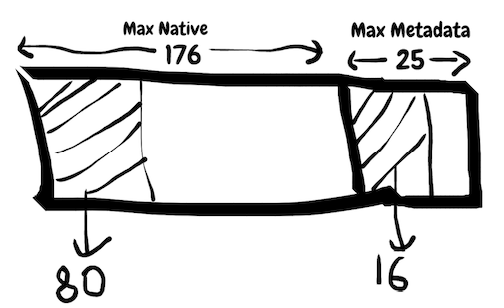
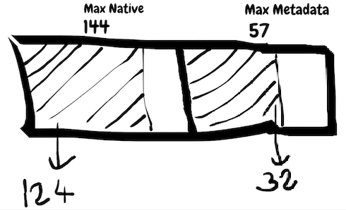

# Prevent Metadata OOMEs

|ℹ️ Since: 4.2|
|-------------|

## Background
HD memory is divided into two parts which are managed by two
different memory-allocators. First part is used to allocate user
data, like key-value pairs. Second part is used to allocate system
and data-structure internals like a contiguous memory area to hold
key-value addresses. This second part is called metadata space.

Both parts are pre-configured before starting a Hazelcast instance.
But at runtime, either part can go out-of-memory even you seem
to have enough memory in total. This out-of-memory condition can
happen depending on the size of the data put. Small user data in
size results with more demand to use metadata space. This demand
may not be fulfilled always due to the pre-configured fixed size
nature of metadata space. If it were elastic, metadata out-of-memory
would be less likely when there is still available HD memory.

### Goal
Decrease the possibility of going out-of-memory
due to the metadata space shortage.

## Design Proposals
Here is a list of design proposals, some needs further
verification with tests, some are applicable with others as well.
Means we can apply multiple proposals together.
### Proposal-1
Metadata space has its own memory allocator. To allocate
data structure internals, it can be abandoned in favor
of the memory allocator that is used for user data.
#### Pros
- Forced eviction can be used since it is in user data
  space when there is no space for data-structure internals.
#### Cons
- This will eat from reserved HD memory of user data.
- All metadata allocators of related data-structures
  should be changed to use user data allocator.

### Proposal-2
For IMap, shrinking internal data structure can be a
solution in some cases, especially when map is evictable.
#### Pros
- Helps to free metadata space, if data
  structure has more deletion than population.
#### Cons
- Code complexity for a questionable possible gain.
  Since deletion probably will be the rare case for a
  map, it is mostly a population only data structure.


### Proposal-3
Issue a MC warning before going metadata OOM.
#### Pros
- User can reconfigure it at runtime
#### Cons
- How to take action when user sees this warning?

### Proposal-4
Make metadata space elastic by going a little more beyond the
pre-configured HD memory limits for it.
#### Pros
- Data structures will still consume metadata space.
- Don't need to change allocators of backing data structures.
#### Cons
- Maybe we need a new property to set the level of
  elasticity: How much can we go beyond the limits?

### Proposal-4 In Action(=Memory Stealing)  
```java
// 200 MB HD Pool
for (int i = 0; i < 1_000_000; i++) {
    map.set(i, i);
}
```


<br>__Metadata OOME: Used: 96 MB, Free 105 MB, Total: 201 MB__


<br>__No OOME: Used: 156 MB, Free 45 MB, Total: 201 MB__
  

# Final Implementation
It is an improved version of Proposal-3 and Proposal-4.

- Issue warning: 
  - when maxMetadata threshold is exceeded
  - when metadata allocations expand into system memory. 
- Only configure HD memory size. 
  - Before this work, one needed to configure HD memory size and
  metadata space percentage. With this work, the configuration for
  metadata space percentage is no longer needed. Configuring it helps
  to see warning logs or MC alerts if configured threshold is exceeded. 
- Use free system memory if metadata allocations
  needs to exceed configured HD memory size.    
   - Metadata allocations have freedom to expand into system
   memory while data space allocations throw Native OOME in
   case of memory shortage. If no available system memory,
   Native OOME for metadata allocations ca still be seen.

# Meaning of Stats
- **maxNative:** Total max usable HD space (both data and metadata allocations) 
- **usedNative:** Total HD space in use (both data and metadata allocations)
- **committedNative:** Same with usedNative
- **usedMetadata:** Metadata HD space in use
- **maxMetadata:** Max usable metadata HD space, this is used only for rising a warnings


