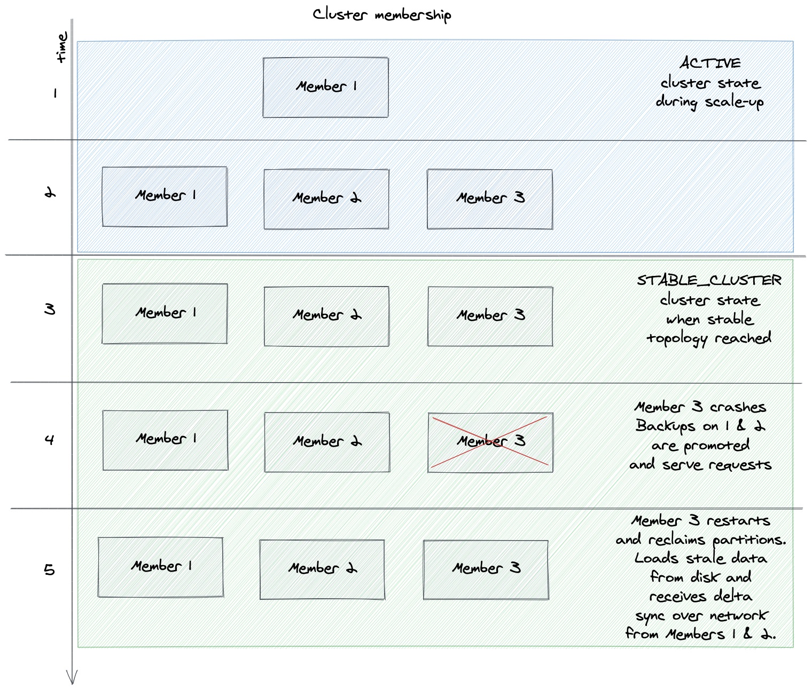

# Advanced Persistence Research

## Background - Overview of Hot Restart

Hot Restart is a recovery mechanism for `IMap` and `Cache`. It operates in two modes:

- During cluster operation, each change to the contents of `IMap` and `Cache` is persisted to log structured files. Let's call this "persistence mode".
- When the cluster is restarted (_under specific supported scenarios_), Hot Restart and Cluster Management orchestrate the start process so that each member populates its partitions with data loaded from disk (if they exist). Then all members restore their previous operational cluster state and Hot Restart operates again in "persistence mode". Let's call this mode of operation the "recovery mode".

#### "Persistence mode" operation

Hot Restart persistence integrates with `IMap` and `Cache` at the `RecordStore` layer: when the respective data structure is configured with Hot Restart enabled, then a Hot Restart-enabled record store instance is created (also taking into account in-memory format).

`IMap` and `Cache` mutations occur in partition threads. The changes are submitted to `ConcurrentConveyor`. Depending on whether `fsync` is enabled or not, the partition thread may be unblocked before the change is persistent.

#### "Recovery mode" operation

When cluster restarts, each member looks for data files in the configured hot restart directory. If persisted data are found, `HotRestartIntegrationService` prepares & executes recovery:

- current member's configured partition count and partition operation thread count should be same as persisted
- cluster metadata (cluster version, partition table, member list) are restored from disk and validated by `ClusterMetadataManager`. If any of the cluster topology and partition related metadata are not valid (e.g. persisted partition count is found to be different than runtime partition count), hot-restart fails and, depending on the configuration, this may result in discarding persisted data or failing node startup. Until all members are done loading data from hot restart, the cluster is put in `PASSIVE` state.
- data are loaded to their respective partitions. Each record loaded from hot restart includes a `long prefix`. The `prefix` is a `long` construct that identifies the data structure and the partition ID to which the key belongs, so locating the partition and partition operation thread to which the record must be submitted is a simple arithmetic operation.
- once a member loads all data, it signals it is ready.
- when all members are done with local data loading, all cluster members restore their cluster state to the persisted one and cluster is ready for normal operation.

## Discussion of requirements

This section discusses the requirements listed in the [PRD](https://hazelcast.atlassian.net/wiki/spaces/PM/pages/1870495795/Advanced+Persistence+-+Reliable+Persistence+-+Research).

### Gap between Hot Restart and becoming a Durable In-Memory DBMS (aka Memory Mirror)

A "[Memory Mirror](https://hazelcast.atlassian.net/wiki/spaces/~jaromir/pages/2359263307/Notes+on+Persistence#Memory-Mirror)" IMDB stores data primarily in memory and uses disk for recovery. From a bird's eye view, this sounds to be exactly what Hot Restart does. However there are restrictions around Hot Restart recovery (identical topology, partition count & partition table version, partition operation thread count) that can result in Hot Restart discarding the persisted data on startup and limit its usefulness. This results in partition migrations over the network which can be impractical in large clusters.

#### Usability issue example: partial member failure and restart in `ACTIVE` cluster state

Assume a cluster configured with hot restart persistence in `ACTIVE` state. In this state, membership changes are allowed in the cluster. The cluster reacts to membership changes by shuffling partition assignment among members, resulting in partition migrations.

In this scenario, if a member shuts down, is terminated or crashes, ownership of its partitions will be transferred to other cluster members. When that same member starts again, hot restart will identify its partition table as stale and will:

* (default) automatically discard locally persisted data and populate its partitions via partition migration mechanism, resulting in long rebalancing time.
* or refuse to startup, when `autoRemoveStaleData == false`.

#### Usability issue example: partial member failure and restart in `FROZEN` cluster state

In the above scenario, when the cluster is set to `FROZEN` state no partition migrations will occur when the member leaves the cluster. Instead, the partitions owned by the missing member will become unavailable. So operations targeting the partitions owned by the missing member(s) will be retried until either they fail (due to operation timeout / reaching retry limit) or succeed, when the member is restarted and joins the cluster.

### Move files to start new cluster

Moving existing hot restart files from an existing cluster to start a new cluster is not possible due to restrictions around cluster membership, partition count and partition operation thread count.

This is requirement #9, also has a dedicated PRD: https://hazelcast.atlassian.net/wiki/spaces/PM/pages/1752400208

### Persistence of all data structures

Hot Restart is only available for `IMap` and `Cache`. In both data structures, it is integrated at the record store level:

* in persistence mode, hot-restart specific implementations of record stores take care of writing each update to hot restart.
* in recovery mode, the same `IMap` and `Cache` hot-restart-specific record store implementations also implement interface `RamStore`, hot-restart's contract for an in-memory store.

Therefore to achieve persistence of other data structures, one has to perform the same kind of integration for each data structure.

Additionally, the abstractions of Hot Restart are developed around a `Key` - `Record` API. These are a good fit for `IMap` , `Cache` and other KV-like structures such as `MultiMap` and `ReplicatedMap` but their integration with other data types like `ITopic`, `IQueue` and `IList` can be problematic and may require development of new abstractions.

Event journal is still `IMap` and `Cache` only, however it can be considered a general change tracking mechanism. If Hot Restart is adapted as an event journal observer, the problem of integrating hot restart persistence with each data structure could be reduced to a (probably) simpler event journal integration problem. This solution does not tackle the issue of having to implement a per-data-structure `RamStore` for recovery mode as well as integrating event journal in each data structure that should become persistent. Also possible effects on atomicity of updates need to be considered.

At a more fundamental level, if different data structures' record store backends are consolidated to a few data structures (similar to Apache Ignite), then the problem of enabling persistence is limited to adding support for each of the backing data structures. However this requires a significant rewrite that will touch every data structure.

In conclusion, making all data structures persistent will require significant effort.

Related PRD: PRD: https://hazelcast.atlassian.net/wiki/spaces/PM/pages/1752727824

### Point in time recovery from snaphost/backup

Hot restart service already allows to create cluster-wide backups by copying currently live hot-restart files. The ability to setup a backup schedule and manage backups can 

This is requirement #7, also has a dedicated PRD: https://hazelcast.atlassian.net/wiki/spaces/PM/pages/1752695081

A [further PRD](https://hazelcast.atlassian.net/wiki/spaces/PM/pages/1752629506/Incremental+Backups) adds requirements for incremental backups and an admin API to manage snapshots.

### Non-atomic record-store updates

An additional issue to consider is that, similarly to index updates ([link to related PRD](https://hazelcast.atlassian.net/wiki/spaces/PM/pages/2452979880/Revise+IMap+storage+and+indices+updates+consistency)), hot-restart persistence is not atomic with the in-memory record store update. Some of the effects of this issue are discussed in "Consistency model" section below, however determining a solution is beyond the scope of this research.

## Technical Design

### Usability enhancements

Prototype (_hacky_): https://github.com/vbekiaris/hazelcast/tree/experiments/4.1/merkle-tree-partition-sync & https://github.com/vbekiaris/hazelcast-enterprise/tree/experiments/4.1/merkle-tree-partition-sync

In this prototype, we explore the possibility of improvements based on `FROZEN` cluster state to allow for membership changes (normal member shutdown or member crash and restart) while cluster remains available and Hot Restart remains useful (does not discard local data).

This design improves Hot Restart by:

* allowing the cluster to remain operational when members are removed from the cluster, unlike `FROZEN` state during which partitions become unavailable.
* improving the speed of recovery by using hot-restart data when members rejoin and performing differential partition sync.



In this mode of operation, a cluster will operate in `ACTIVE` cluster state while scaling up or down. Once the expected topology is reached, the cluster is switched to `STABLE_CLUSTER` state. In this state:

* only members that left the cluster during `STABLE_CLUSTER` state are allowed to rejoin. No new members can join; to scale up or down the cluster, the cluster state must be changed to `ACTIVE`.
* promotions and migrations are allowed.
* members rejoining the cluster will reclaim their previously owned partitions. The locally persisted data will be reloaded from disk. In order to bring the partition data up to date, differential partition sync will be performed from other cluster members.

These changes touch mostly the cluster membership, partitioning and migration subsystems.

#### Cluster membership in STABLE_CLUSTER state

Similarly to `FROZEN` cluster state, new members are not allowed to join, except members that left during `STABLE_CLUSTER` , `FROZEN` or `PASSIVE` state.

#### Partitioning

When cluster state is changed to `STABLE_CLUSTER` , `PartitionStateManager` saves a snapshot of current partition table. This is the reference "stable partition table". When members leave the cluster, backups are promoted and shifted up. When a gone member rejoins the cluster, it is given back ownership of the original partitions that were assigned to it in the stable partition table.

In `MigrationManager$RepairPartitionTableTask` the cluster's `master` repairs the partition table and performs partition promotions, reacting to a membership change event. Further, in `RepartitioningTask`, partitions are re-arranged and migrations are planned and executed. In `STABLE_CLUSTER` state, when a member joins the cluster, the stable partition table is scanned for partitions owned by that member. Partition ownership is given back to the joining member and replication is triggered.

#### Migration planning

The `MigrationPlanner` takes care of emitting step by step `MigrationInfo`s that describe how to transition the partition replica assignment from current to new state. With `STABLE_CLUSTER` state there are cases in which the generated plan seems sub-optimal. For example, let's assume a cluster with 3 members `A`, `B` and `C` from which `C` leaves. When `C` rejoins the cluster in `STABLE_CLUSTER` it is given back ownership of its previously owned partitions. This partition replica assignment change and the migrations planned for the transition of a single partition look like this:

```
Partition replica assignments
current state      new state
[A, B, null]   ->  [C, A, B]

Migrations planned (master branch):
(1) {src=A, currentReplicaIndex=0, newReplicaIndex=-1},
    {dst=C, currentReplicaIndex=-1, newReplicaIndex=0} <- partition data are deleted from A
(2) {src=B, currentReplicaIndex=1, newReplicaIndex=2},
    {dst=A, currentReplicaIndex=-1, newReplicaIndex=1} <- partition data are restored into A
```

Assuming an `IMap` with one backup (default configuration), this sequence of planned migrations results in deleting the perfectly good data from member `A` that owns the partition and then copying them back again in the second step. Instead, we could achieve massive savings on data movement across the network by scheduling migrations like this:

```
(1) {src=null, currentReplicaIndex=-1, newReplicaIndex=-1},
    {dst=B, currentReplicaIndex=1, newReplicaIndex=2}
(2) {src=A, currentReplicaIndex=0, newReplicaIndex=1},
    {dst=C, currentReplicaIndex=-1, newReplicaIndex=0}
```

#### Differential migration data synchronization

This section explores ideas to make partition migrations more efficient when a member rejoins the cluster, having read some potentially stale data from hot-restart store.

##### Current situation

Partitions are migrated by transferring fragments of partitions, when a service is a `FragmentedMigrationAwareService`, or the complete partition data for the service. `IMap` and `Cache` are fragmented, each fragment corresponding to the data of a single `IMap`/`Cache` in the partition being migrated.

When a member rejoins the cluster with hot-restart enabled, if its partition table is stale then, depending on the data recovery policy, the hot restart data are either discarded or startup fails.

##### Using replica fragment versioning

(not prototyped)

In migrations across running members over the network, replica sync versions are compared between source and destination to avoid transferring data unnecessarily. On a joining member, there are no previously known replica fragment versions. In order to take advantage of replica fragment versions during hot restart, they must be persisted and restored on startup. The usefulness of this approach is limited as full partition sync can be only avoided when there are no mutations (read-only ``IMap``s and ``Cache``s).

##### Tracking mutations with an event journal observer

An alternative could be to track mutations by adding a ``MutationObserver`` that tracks updated and removed keys since a given partition version. This works like this:

* On partition promotion, a `HotRestartObserver` is registered in the `IMap`'s or `Cache`'s mutation observer.
* The `HotRestartObserver` implementation maintains a set of changed and removed keys
* When a member rejoins, the `MapReplicationStateHolder` (or similarly the `CacheReplicationOperation`) picks for replication the individual keys which were mutated instead of performing a full sync

An implementation is prototyped in https://github.com/vbekiaris/hazelcast-enterprise/blob/c7391530b40a73fea0528859a4b3d84377136fe1/hazelcast-enterprise/src/main/java/com/hazelcast/map/impl/recordstore/EnterpriseRecordStore.java#L295. Caveats:

* All partition replicas need to track mutations, so that in the event a second (or third, up to the configured backup count) member is lost, the respective promoted replica keeps track of all mutations.
* Given the above, all members will be burdened with the memory overhead of keeping references to changed keys. For each on-heap key, this can be the cost of a reference to the key's `Data`. For `NATIVE` memory, a construct like `KeyHandleOffHeap {long address; long sequence;}` is required to avoid A-B-A problem and a tighter integration with the native record store is needed, as the `Data` key's address can only become known after the record store has performed the mutation.
* Mutation tracking can get complicated when having to keep track of several member joins/departures from the cluster. 

##### Using Merkle trees

We are able to reuse the Merkle-tree based differential sync mechanism, already in use for WAN sync for `IMap`, to transfer a portion of the full partitions' data over the network. This feature can be also used as anti-entropy replication mechanism.

In `MapMigrationAwareService#prepareReplicationOperation(PartitionReplicationEvent event, Collection<ServiceNamespace> namespaces)`, when an `IMap` is configured with Merkle trees enabled, the migration source can initiate a level-by-level comparison of Merkle tree node values so that a subset of that `IMap`'s partition data including those that have been mutated can be replicated to the destination. This differential sync method requires enabling Merkle trees in the `IMap` 's configuration and only works for `IMap`s, since Merkle trees are not support for `Cache`.

## Benchmarks

**CAVEAT: the prototype touches arcane code such as the `MigrationPlanner`, therefore might be buggy and results may be misleading. Benchmarks were executed on `master` branch before parallel partition migrations PR was merged, therefore results may differ significantly.**

### Single member removal & startup with `STABLE_CLUSTER`

Base scenario:

* Start a clean 4-members cluster with default 271 partitions. Using `r5d.8xlarge` instances (32 vCPUs, 256 GiB RAM, 2 * 600GiB NVMe SSD, 10 Gbps network).
* A single `IMap` is configured with `NATIVE` in-memory format, Hot Restart with `fsync == true`  and 3 backups (so each member has all the `IMap`'s data in-memory and persistent on disk).
* Initially load 4,000,000 entries with 10KB values, so cluster holds 4 replicas (primary + 3 backups) of 40GB of data = 120GB in total.
* A single member leaves the cluster (graceful shutdown or kill, depending on specific test).
* Wait until cluster is safe. At this point we measure number of migrations, elapsed time and number of records transferred with `MapReplicationOperation`.
* Member is restarted, restoring persisted data from hot-restart.
* Wait until cluster is safe. Measure again above quantities.

```bash
hz cluster -size ${size} -v ${version}_${upVersion} -ee -boxes a.box -user ${user} -upcwd log4j.properties

hz run load
hz run clusterStable

sleep 10
hz kill Member1
hz driver Member3
hz run untilClusterSafe
hz restart Member1 -ee
hz run untilClusterSize4 untilClusterSafe
hz check
```

The test was executed with 3 different configurations:

* Using full partition replication (as in `master`), with `STABLE_CLUSTER` state.

* Differential partition replication with Merkle tree (new in the research prototype).
* Differential partition replication with Merkle tree with migration planner optimizations (new in the research prototype).

|                                                              | Number of migrations / records transferred<br />(on member kill) | Time to safe state<br />(on member kill) | Number of migrations / records transferred<br />(on member restart) | Time to safe state<br />(on member restart) |
| :----------------------------------------------------------: | ------------------------------------------------------------ | :--------------------------------------: | ------------------------------------------------------------ | ------------------------------------------- |
|                     Full partition sync                      | 340 / 5,018,209                                              |          1,202 sec (20min 2sec)          | 475 / 10,020,466                                             | 1,688 sec (28min 8sec)                      |
|          Differential (Merkle-tree) partition sync           | 341 / 0                                                      |                 0.6 sec                  | 477, of which 48 are full partition syncs / 709,529          | 724 sec (12min 4sec)                        |
| Differential (Merkle-tree) partition sync with migration planner optimizations | 340 / 0                                                      |                 0.5 sec                  | 410 / 0                                                      | 6.7 sec                                     |

Discussion: the use case of a read-only reference `IMap` is the most favourable for differential sync. When the missing member rejoins the cluster, all data are read from hot restart store and safe state is reached as soon as Merkle trees between current owner and joining member are compared.

As far as the time to safe state on member kill is concerned, the huge speed-up is due to `IMap` backups being present on all members (in addition to differential sync avoiding data migrations altogether). This advantage disappears with lower backup counts and full partition syncs are needed in that case, making it as bad as the full partition sync. However with persistence enabled, a different kind of backup configuration (see section "Other considerations around backups") would probably make more sense and allow instant and OOME-risk-free response to crashing members, regardless of number of configured backups.

### Single member removal & startup with `STABLE_CLUSTER` with 10% mutation

This scenario is same as previous, adding 10% of keys being mutated while the killed member is down. Therefore on startup, partition replication must update the data restored from hot restart.

|                                                              | Number of migrations / records transferred<br />(on member kill) | Time to safe state<br />(on member kill) | Number of migrations / records transferred<br />(on member restart) | Time to safe state<br />(on member restart) |
| :----------------------------------------------------------: | ------------------------------------------------------------ | :--------------------------------------: | ------------------------------------------------------------ | ------------------------------------------- |
|                     Full partition sync                      | 338 / 4,987,066                                              |          1,208 sec (20min 8sec)          | 475 / 6,938,563                                              | 1,597 sec (26min 37 sec)                    |
|          Differential (Merkle-tree) partition sync           | 340 / 0                                                      |                 0.5 sec                  | 475 / 4,339,161 (full syncs: 2,994,412 - differential syncs: 1,344,749) | 1,543 sec (25min 43sec)                     |
| Differential (Merkle-tree) partition sync with migration planner optimizations | 338 / 0                                                      |                 0.5 sec                  | 409 / 1,697,617                                              | 1,089 sec (18min 9sec)                      |

Discussion: differential sync and migration optimizations lowered the number of records transferred by 75% (vs full partition sync case). In terms of time elapsed to safe state, the reduction is ~30%. A possible explanation for the disconnect between reduction of number of records transferred and time to safe state is that for each migration some additional time is spent on network operations exchanged across members to compare the Merkle trees. Currently comparison of Merkle trees is performed level-by-level, so first local values for level == 0 are checked vs remote values for same level, then, if differences exist, we move on to level 1 etc. In the worst case, identifying differences may require number of remote operations up to the configured Merkle tree depth / 2. To avoid network chattiness, we may transfer multiple Merkle tree levels in one operation, however this was not implemented in this prototype. Additionally, in some cases sporadic migration failures occurred with the migration planner optimizations, which re-triggered the repartitioning task.

## Further improvements

### Deterministic partition assignment

The current implementation of partition assignments (in `PartitionStateGeneratorImpl`) is not deterministic. Using a deterministic algorithm to assign partitions (for example based on member UUIDs and the member list order) would eliminate the requirement for maintaining a "stable partition table" with `STABLE_CLUSTER` state. Additionally, partition assignment being deterministic would probably benefit other cluster operations since it would minimize the need for central coordination of partition table updates and migrations.

### Other considerations around backups

The current `backupCount` / `asyncBackupCount` configuration results in partition migrations whenever a member leaves, with Hazelcast always striving to maintain as many backups as configured (given enough members still exist on the cluster). This configuration answers the question "how many nodes can fail *concurrently* before some data are lost" and makes sense for an in-memory only data store.

However other databases configure availability with users answering the question "how many nodes can fail before some data might be lost". For example see the concept of "k-safety" ([VoltDB documentation](https://docs.voltdb.com/UsingVoltDB/ChapKSafety.php#KSafeHowItWorks)) or [Cassandra's replication factor](https://docs.datastax.com/en/cql-oss/3.3/cql/cql_reference/cqlCreateKeyspace.html?hl=replication%2Cfactor).  In Hazelcast terms, implementing a "k-safety" factor would mean that loss of a member from a stable cluster would not result in network migrations to sync new replicas, which may result in an out-of-memory domino on the remaining members.

## Other artifacts

### Notes from Aerospike documentation

https://www.aerospike.com/docs/operations/manage/migration/index.html

* Schemaless KV store
* Organization of data: namespaces (=*databases*), sets (=*tables*), records (=*rows*). Each record has a unique indexed key and one or more bins (=*columns*). Sets and bins are not predefined, they are added at runtime. Values in bins are strongly typed - bins themselves are not so the same bin can have a value of a different type in another record.
* Primary & optional secondary indexes are stored by default in DRAM. Can be configured to be stored in PMEM or NVMe flash device. Values can be stored in DRAM or SSD (so it can operate in-memory-only or with SSD). Storage config is per namespace.
* Claim from https://www.aerospike.com/docs/architecture/: *100 million keys only take up 6.4GB. Although keys have no size limitations, each key is efficiently stored in just 64 bytes.* 
* SSD storage seems similar to HotRestart: *Native, multi-threaded, multi-core Flash I/O and an  **Aerospike log structured file system**  take advantage of low-level SSD read and write patterns. To minimize latency, writes to disk are performed in large blocks.*
  * **But take note of this**: *This mechanism bypasses the standard file system, historically tuned to rotational disks.*
  * "Smart Defragmenter" seem similar to HotRestart's garbage collector
  * "Evictor" *Removes expired records and reclaims memory if the system gets beyond a set high-water mark*
* Also notice the limitation: *For both in-memory and persistent namespaces, the total memory / disk  space allocated for each namespace on each node should be the same (other than transient state when changing capacity)*. Additionally, Aerospike uses a non-configurable number of 4096 partitions.
* Employs a deterministic partition assignment algorithm, as described in ["Aerospike: Architecture of a Real-Time Operational DBMS" (VLDB 2016)](https://www.aerospike.com/docs/architecture/assets/vldb2016.pdf).

## Terminology

| Term                    | Description                                                  |
| ----------------------- | ------------------------------------------------------------ |
| Promotion               | A partition migration that involves a single member of the cluster changing its replica index to primary replica (index 0). For example a `MigrationInfo{source=null, destination=192.168.1.10:5701, destinationCurrentReplicaIndex=1, destinationNewReplicaIndex=0}`. |
| Interim partition table | The partition table on a cluster that is running in `STABLE_CLUSTER` state and is not the stable partition table. A cluster runs on an interim partition table as a result of membership changes after `STABLE_CLUSTER` state was reached. |
| Stable partition table  | A snapshot of the partition table obtained on all cluster members when cluster state transitions to `STABLE_CLUSTER`. |
