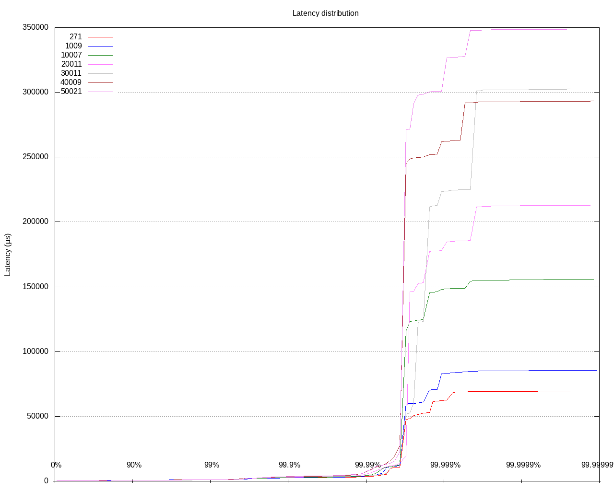
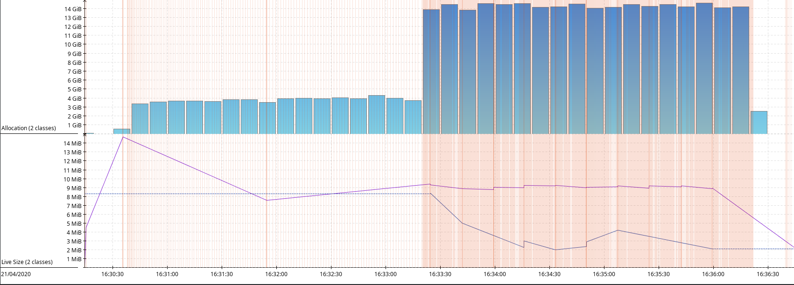

# Default Settings 
> Baseline with default config IMap features
> Runs seen under tag `Group 2` at 
>[Runs Matrix](https://docs.google.com/spreadsheets/d/1ZXbXrnK9Pg-0NNjaHSza_xEwzw8PGxNajcdc9Vs89mg/edit?usp=sharing)
 
## Environment
AWS instances c5.9xlarge and default Hazelcast 4.0 settings  
10 GB Primary Data, 20 GB Total  
Heap space allocated 5GB with CMS default settings
Tests are done on a stable cluster with no ongoing migrations.

**Members**

- Total count 3
- Native In-Memory format
- Single Map
- 1M entries - 10KB each
- Ratio 1/1
- 1 Sync backup
- Partition counts 271 - 50021

**Clients**

- Total count 5
- Client threads 32

## Report
All graphs below show comparable results for the majority of percentiles, but higher percentiles demonstrate worse
performance repeatedly that correlate to GC load as we will see later.




|                271 Partitions                 |                  50021 Partitions               |
|-----------------------------------------------|-------------------------------------------------|
|||


## GC Stats

| Partitions            | 271         | 1009        | 20011        | 50021        |
| --------------------- | ----------- | ----------- | ------------ | ------------ |
| Total GC count        | 141         | 141         | 143          | 138          |
| Total reclaimed bytes | 197.1 gb    | 198.08 gb   | 196.65 gb    | 192.19 gb    |
| Total GC time         | 480 ms      | 540 ms      | 1 sec 300 ms | 1 sec 810 ms |
| Avg GC time           | 3.40 ms     | 3.83 ms     | 9.09 ms      | 13.1 ms      |
| GC avg time std dev   | 9.81 ms     | 10.9 ms     | 30.6 ms      | 52.3 ms      |
| GC min/max time       | 0 / 60.0 ms | 0 / 70.0 ms | 0 / 200 ms   | 0 / 400 ms   |
| GC Interval avg time  | 751 ms      | 776 ms      | 774 ms       | 765 ms       |

## Summary

Increased partition counts demonstrate higher GC pauses (total), but performance itself doesn't demonstrate noticeable degradation.
Looking closer at JFR recordings the GC pressure index is increasing as the count increases, starting from 22% on 271 partitions,
 25% on 1K partitions, to 47% on 10K partitions, all the way to 77% for 50K. 
 
 //TBD need more runs to pin-point the root, also include the promotion rates, and run tests with longer periods

# Nearcache
> Runs seen under tag `Group 9` at 
>[Runs Matrix](https://docs.google.com/spreadsheets/d/1ZXbXrnK9Pg-0NNjaHSza_xEwzw8PGxNajcdc9Vs89mg/edit?usp=sharing)

No observable issues noticed with increased partition count in the context of Near Cache, other than the usual overload of the
Eventing sub-system under heavy writes and increased number of clients. 
Different tests with different near cache percentages gave no observable degradation.

# Indexes
> IMap indexes with big-data or increased partition count  
> Runs seen under tag `Group 7` & `Group 8` at 
>[Runs Matrix](https://docs.google.com/spreadsheets/d/1ZXbXrnK9Pg-0NNjaHSza_xEwzw8PGxNajcdc9Vs89mg/edit?usp=sharing)
 
## Environment
AWS instances c5.9xlarge and default Hazelcast 4.0 settings  
Heap space allocated 8GB with CMS default settings

**Members**

- Total count 5
- Native In-Memory format
- Single Map
- 100M entries(~240B)
- Ratio 1/1
- 1 Sync backup
- Partition counts 271 - 50021

Cluster size (incl. backups) ~48GB

**Clients**

- Total count 5
- Client threads 32

## Report
When it comes to querying stuff other than very trivial predicates, that utilize more than one index  
and these indexes are not ideal for the Query at hand, indexes affect tremendously both speed and space.  
More indexes, means that we have to go through more of them if their indexed attribute is included in the predicate,  
resulting in higher memory occupancy and speed degradation as a side effect.  

### Issue 1
Let's have a simple example of this:

A `TaxPayer` java class is the main model.
```
public class TaxPayer
        implements DataSerializable, Comparable<TaxPayer> {

    int id;
    String name;
    String company;
    int age;
    double salary;
    boolean active;
```

The model occupies roughly 240 bytes of Native format, without including the cost of indexes.

The individual fields have the following possible values

- Company - 20 Distinct companies
- Salary - Range of 0 - 1M
- Age - Range of 0 - 75

These fields are also indexed, salary & range as ordered indexes, and company as hash.  
A query to identify entries of a given company, under a certain age and of a small salary range (50K - 51K)   
fetches, an average of 200 entries.

Query: `(salary BETWEEN 50K AND 51K AND (age<40 AND company=Y))`  

The query above when it runs on a Map that has indexes on all fields (as described above), consumes a lot of heap
to materialize all predicate results, which, in some cases, fetch much larger entry sets, creating a lot of GC pressure. In a benchmark where all clients attempt a similar
query, HZ can handle less than 1 operation / second.

_Note the 1st lines, total allocations._


|                       |              |
|-----------------------|--------------|
| Total created bytes   | 4\.55 tb     |
| Total promoted bytes  | 7\.72 gb     |
| Avg creation rate     | 5\.84 gb/sec |
| Avg promotion rate    | 9\.89 mb/sec |


Once we remove the `Age` & `Company` indexes, meaning that we only have to use a single index, HZ can now handle 90 operations / sec, with significantly less allocations.


|                       |              |
|-----------------------|--------------|
| Total created bytes   | 2\.48 tb     |
| Total promoted bytes  | 190\.96 mb   |
| Avg creation rate     | 4\.74 gb/sec |
| Avg promotion rate    | 365 kb/sec   |


Worth noting that the above two captures are from runs with partition count set to 1999.

### Issue 2

`QueryOperation` is responsible for running a given query.  
When the in-memory-format is Native, then it off-loads the task. 

```java
@Nonnull
private CallStatus callInternal() {
    QueryRunner queryRunner = getMapServiceContext().getMapQueryRunner(getName());

    switch (getMapInMemoryFormat()) {
        case BINARY:
        case OBJECT:
            ...
        case NATIVE:
            BitSet localPartitions = localPartitions();
            if (localPartitions.cardinality() == 0) {
                ...
            } else {
                return new OffloadedImpl(queryRunner, localPartitions);
            }
        default:
            throw new IllegalArgumentException("Unsupported in memory format");
    }
}
```

The offloaded task, runs a `QueryTaskFactory` on all local partitions
```java
public void start() {
    QueryFuture future = new QueryFuture(localPartitions.cardinality());
    getOperationService().executeOnPartitions(new QueryTaskFactory(query, queryRunner, future), localPartitions);
    future.whenCompleteAsync(new ExecutionCallbackImpl(queryRunner, query));
}
```

which in turn, creates a `QueryTask` for **every** local partition.
```java
public void run() {
    IPartition partition = getNodeEngine().getPartitionService().getPartition(partitionId);
    if (!partition.isLocal()) {
        future.addResult(partitionId, null);
        return;
    }

    try {
        Result result
                = queryRunner.runPartitionIndexOrPartitionScanQueryOnGivenOwnedPartition(query, partitionId);
        future.addResult(partitionId, result);
    } catch (Exception ex) {
        future.completeExceptionally(ex);
    }
}
```

Within this flow, our indexes mark query results with the partition ids they represent, and/or listing local partitions, by utilizing  a `BitSet` wrapped in a `PartitionidSet` class. The `BitSet` is backed by an array of `long` values. 

With the default value of 271 partitions, this `BitSet` can represent them by using 4 long values. 

`4 * 8 = 32 bytes`

This datastructure is initialized twice per partition during a query, therefore

`32 * 2 = 64 bytes`

a cluster with 5 members, will have, roughly 50 partitions local on a member, thus,

`64 * 50 = 3.2KB`

However, when we increase the partition count to thousands, ie. 50K partitions, then the `BitSet` can represent them with 800 long values.

`800 * 8 * 2 * 10K (local partitions on a member) = 128MB` for a single query. This can easily create an OOME by simply handling
a dozen of queries, just for tracking partition IDs, regardless of the result sets.

The grow is exponential, smaller partition count figures, create much less objects, but still for a system under pressure, these tend to get promoted to the old generation.


The problem can be seen in the throughput & latency charts below, where increasing the partition count gives some extra
performance at the beginning, but slowly it starts to put more pressure to GC, thus ultimately affecting latency & throughput.


A comparison of the GC allocations and live set (byte[] vs long) when the partition count is increased.

- 271 partitions
(_blue line in the live set is the long objects_)


- 1999 partitions
(_blue line in the live set is the long objects_)


- 5009 partitions
(_blue line in the live set is the long objects_)


## Summary

Both problems should be improved by the introduction of the new Query engine with global indexes.  
Having said that we still have to make sure the legacy API doesn't suffer from these findings when the changes become available.

# Map Stores
//TBD

# Multi Partition Operations
> Runs seen under tag `Group 5` 
>[Runs Matrix](https://docs.google.com/spreadsheets/d/1ZXbXrnK9Pg-0NNjaHSza_xEwzw8PGxNajcdc9Vs89mg/edit?usp=sharing)

## Report

For this test, the `Map.size()` operation was mostly targeted, but similar observations were noticed with other multi-partition
operations. During the benchmark, 10% of the operations were a call for `size` for partition counts as low as 271 and as high as
50K. The problem shows up instantly even for partition counts close to 1K, we have a throughput degradation of 60% or more.
Similarly, for partition counts closer to 50K the throughput is down >99%.

The reason behind this degradation, once again is heavy GC involvment. The promotion rate is roughly 250 MB/s and even in single
digit minute figures testing periods, we have tens of full GC counts with significant pauses.


The reason seems to be the allocation patterns of the following places:
- `com.hazelcast.internal.partition.impl.InternalPartitionServiceImpl.getMemberPartitionsMap` more specifically the `Array` 
creation per member, along with the boxed `Integer` values.

```java
@Override
public Map<Address, List<Integer>> getMemberPartitionsMap() {
    Collection<Member> dataMembers = node.getClusterService().getMembers(DATA_MEMBER_SELECTOR);
    int dataMembersSize = dataMembers.size();
    int partitionsPerMember = (dataMembersSize > 0 ? (int) ceil((float) partitionCount / dataMembersSize) : 0);

    Map<Address, List<Integer>> memberPartitions = createHashMap(dataMembersSize);
    for (int partitionId = 0; partitionId < partitionCount; partitionId++) {
        Address owner = getPartitionOwnerOrWait(partitionId);
        List<Integer> ownedPartitions =
                memberPartitions.computeIfAbsent(owner, k -> new ArrayList<>(partitionsPerMember));
        ownedPartitions.add(partitionId);
    }
    return memberPartitions;
}
```
- `com.hazelcast.spi.impl.operationservice.impl.operations.PartitionIteratingOperation.OperationResponseHandlerImpl.responseArray`
```java
private class OperationResponseHandlerImpl implements OperationResponseHandler {

    // an array with the partitionCount as length, so we can quickly do a lookup for a given partitionId.
    // it will store all the 'sub' responses.
    private final AtomicReferenceArray<Object> responseArray = new AtomicReferenceArray<Object>(
            getNodeEngine().getPartitionService().getPartitionCount());

    // contains the number of pending operations. If it hits zero, all responses have been received.
    private final AtomicInteger pendingOperations;
    private final int[] partitions;

    OperationResponseHandlerImpl(int[] partitions) {
        this.partitions = partitions;
        this.pendingOperations = new AtomicInteger(partitions.length);
    }
    ...
}
```
- `com/hazelcast/spi/impl/operationservice/impl/operations/PartitionIteratingOperation.java:263` <- Object array in `sendResponse`
```java
private void sendResponse() {
    Object[] results = new Object[partitions.length];
    for (int k = 0; k < partitions.length; k++) {
        int partitionId = partitions[k];
        Object response = responseArray.get(partitionId);
        results[k] = response == NULL ? null : response;
    }

    PartitionIteratingOperation.this.sendResponse(new PartitionResponse(partitions, results));
}
```


Note: The call to `size` is a rather cheap/trivial call that is as simple as accessing a field in the partition, other multi-partition
operations which fetch objects from each partition, can increase the footprint even more.

Note: Other offenders might also exist in the execution path, but at this point they are hidden by the ones listed above.

During the test duration the pending invocations in each member are incrementing linearly further demonstrating the inability
of the node to resume in a healthy mode.


All figures above are from runs with 50K partitions. The pattern is also visible with partition counts as low as 1K, but less 
prominent.


# Anti Entropy

Findings summarized here https://github.com/hazelcast/hazelcast/issues/17012 which already has a fix, but needs further testing
with much higher partition counts of 50K

# Expirable entries (TTL / MaxIdle)

## Environment

Cluster nodes: 5
Memory format: NATIVE
Number of clients: 10 (no work)

1 Map, count: 250K entries
Entry size: randomly selected byte lengths from [1020, 2040, 4090, 6110, 9190]

Expiration task props: 4.1 defaults (see. `MapClearExpiredRecordsTask.java`)
```java
    private static final boolean DEFAULT_PRIMARY_DRIVES_BACKUP = true;
    private static final int DEFAULT_TASK_PERIOD_SECONDS = 5;
    private static final int DEFAULT_CLEANUP_PERCENTAGE = 10;
```
** Random expiration on entries, varying from 1 min to 50K mins exclusive.

The test code doesn't stress the cluster, it starts with putting the entries and then goes in idle mode.
```java
private static final int[] SIZES = new int[] {1020, 2040, 4090, 6110, 9190};

public static void main(String[] args)
        throws InterruptedException, IOException, ParseException {
    Config config = new Config();
    config.getNativeMemoryConfig().setEnabled(true).setAllocatorType(
            NativeMemoryConfig.MemoryAllocatorType.POOLED).setSize(MemorySize.parse("3G"));
    config.getMapConfig("Blah").setInMemoryFormat(InMemoryFormat.NATIVE);
    config.getMapConfig("Foo*").setInMemoryFormat(InMemoryFormat.NATIVE);

    config.setProperty("hazelcast.initial.min.cluster.size", "5");
//  config.setProperty("hazelcast.internal.map.expiration.cleanup.percentage", "30");
    config.setProperty("hazelcast.partition.count", "N");

    HazelcastInstance instance = Hazelcast.newHazelcastInstance(config);

    HazelcastClient.newHazelcastClient();
    HazelcastClient.newHazelcastClient();

    Random r = new Random();
    int mapCount = 10;
    for (int i = 0; i < 50_000 / mapCount; i++) {
        byte[] value = new byte[SIZES[r.nextInt(SIZES.length)]];
        for (int k = 0; k < mapCount; k++) {
            instance.getMap("Foo_" + k).put("Key_" + i, value);
        }
    }

    Thread.sleep(100_000_000);
}
```

## Report
Increasing the partition count has an effect on the way we attempt to clean expired entries. The current approach,
which is a periodic task that gets scheduled to run every 5 seconds by default, gets a good hit on allocation rate when iterating
over the partition ids to collect the containers that need to have entries evicted.

### 1 Map 271 partitions
with the default 271 partitions


### 1 Map 50K partitions
Some figures with 50K partitions


The difference presents **linear growth** in accordance to the partition count.
To make things slightly worse, this heap cost is the result of the pre-cleaning phase, when we actually scan local partitions
for potential containers that need cleaning, in other words once any `RecordStore` is marked as expirable 
(either through config or due to expirable entry) we introduce this cost at minimum. 

Number of maps does not seem to affect this cost, in any noticeable way anyway.

The affected code appears to be inside `ClearExpiredRecordsTask.java`:
```java
    private void runInternal() {
        runningCleanupOperationsCount = 0;

        long nowInMillis = nowInMillis();
        boolean lostPartitionDetected = lostPartitionDetected();

        List<T> containersToProcess = null;
        for (int partitionId = 0; partitionId < partitionCount; partitionId++) {
            T container = this.containers[partitionId];

            IPartition partition = partitionService.getPartition(partitionId, false);
            if (partition.isMigrating()) {
                continue;
            }

            if (partition.isLocal()) {
                if (lostPartitionDetected) {
                    equalizeBackupSizeWithPrimary(container);
                }
            }

            if (canProcessContainer(container, partition, nowInMillis)) {
                containersToProcess = addContainerTo(containersToProcess, container);
            }
        }

        if (!isEmpty(containersToProcess)) {
            sortPartitionContainers(containersToProcess);
            sendCleanupOperations(containersToProcess);
        }

        sendExpiryQueuesToBackupIncrementally();
    }

```

### 10 Maps 2K partitions

On average, we allocate 1.2K objects / sec, on a stable & idle cluster (on a single member), with the total rate being 1.55K.  
That represents roughly **80%** of total allocations.


### 100 Maps 2K partitions  
  
On average, we allocate 1.8K objects / sec, on a stable & idle cluster (on a single member), with the total rate being 3.4K.  
That represents roughly **52%** of total allocations.


### 10 Maps 2K partitions (30% clean percentage)

When we change the clean percentage, the actual clear operation litters more (as expected) but it shows no relation to the actual
number of partitions.


### 10 Maps 50K partitions

On average, we allocate 2.2K objects / sec, on a stable & idle cluster (on a single member), with the total rate being 7.2K.  
That represents roughly **30%** of total allocations.


### 100 Maps 50K partitions  
  
On average, we allocate 3.7K objects / sec, on a stable & idle cluster (on a single member), with the total rate being 9.3K.  
That represents roughly **40%** of total allocations.


>In all cases above, the total number of entries in the cluster are the same as with the initial test, they are just split
equally among the maps

## Summary
As seen by the screens above, there are two distinct *issues*, or else heap protagonists.  
A. The task that prepares the operations and sends them to all relevant destinations  
B. The actual cleaning operation

Number of partitions appears to have a close relationship with issue A whereas issue B is linearly affected by map count instead.
Both issues need to be resolved for large-cluster support, which in reality could mean more tenants on the same cluster 
ie. more maps, however the first finding is not likely to cause issues with must smaller partition counts.

# Metrics collection

## Report

We measured the new metrics sub-system under idle conditions on the cluster, with different partition counts and different number
of Maps. It shows an allocation rate which is not so worrying by itself, but it can be improved.

Here is the original TDD with some benchmarks done by Zoltan the author of the Metrics
https://hazelcast.atlassian.net/wiki/spaces/EN/pages/1855029395/MC+-+New+Metrics+System+-+CORE+-+Design+Document#MC-NewMetricsSystem-CORE-DesignDocument-Benchmarks

On a singe HD Map, 250K entries (5 nodes) and default 271 partitions, we see roughly 800 allocations / second


On a singe HD Map with 250K entries (5 nodes) and 50K partitions we see roughly 1300 allocations / second


On 10 HD Maps with 250K entries equally distributed (5 nodes) and 50K partitions, we see 2000 allocations / second.


It appears that both partition counts & number of Maps affect the allocation rate of the metrics service. This can increase
even further in the context of large clusters, potentially with multi-tenancy setups that can yield significant amount of Map 
instances, in combination with large partition counts. 

Note: As I came to realize later, number of clients can also affect the allocation rate for the Metrics service, but it was not
tested further.

Ideally, we need a quiet system under idle conditions, and for instrumentation systems like our Metrics, it would be nice if we
could make them allocation free, or at the very least allocate when changes happen and not during the collection routine.

# PartitionIdSet

As already described in the [Indexes section](#Indexes), the `PartitionIdSet` backed by
a `BitSet` is not a good fit when we are going partition counts upwards to 50K. The number of longs required to keep
track of these many partitions results in multi KB objects, which are used in many places throughout the code.
Some examples are, Queries, Invocations, Migrations, Client state view etc.

---
One important offender of this is the `ClientClusterViewListenerService` which during migrations, it creates a view of the cluster
for every migration event. Increasing partition, increases migrations and could lead to figures as high as 200K allocations / sec
(on average) for 50K partitions.

One improvement on this area, which defers the updates when they happen within a short period,
https://github.com/hazelcast/hazelcast/pull/16938
but even with that, default 500ms max-delay, we create roughly 20K objects on average, while migrating.


while with **1 second** max delay


Additionally, as seen in the screen-shot, the `getPartitions()` method (see below) is creating a lot of litter with the use of a `LinkedList` which in combination
with the boxed primitive values (Integer) creates quite a lot of litter. 

```java
public Map<UUID, List<Integer>> getPartitions(PartitionTableView partitionTableView) {
        Map<UUID, List<Integer>> partitionsMap = new HashMap<>();

        int partitionCount = partitionTableView.getLength();

        for (int partitionId = 0; partitionId < partitionCount; partitionId++) {
            PartitionReplica owner = partitionTableView.getReplica(partitionId, 0);
            if (owner == null || owner.uuid() == null) {
                partitionsMap.clear();
                return partitionsMap;
            }
            partitionsMap.computeIfAbsent(owner.uuid(),
                    k -> new LinkedList<>()).add(partitionId);
        }
        return partitionsMap;
    }

```

Logged an issue on this area https://github.com/hazelcast/hazelcast/issues/17087 with some minor suggestions.

---

We investigated for cheaper solution for large partition counts. 
A scenario with 100K partitions and 5 members (assuming equal count of partitions per member, randomly selected), 
gives the following results:

- Default BitSet: **9,1KB**
- com.zaxxer.SparseBitSet: **7.3KB**
- com.hazelcast.query.impl.bitmap.SparseBitSet: **8.4KB**

Zaxxer: https://github.com/brettwooldridge/SparseBitSet

Changing the number of members, results in some fluctuation on the Default BitSet, seen sizes as big as 11KB and as small 
as 7.4KB. It all depends on the randomization in this case, but its a fair estimation. 
Given these results, it doesn't look promising to invest more time towards this direction.

## Possible solutions

### Partition ranges
If we had fixed ranges of partitions per member, thus we only track the range ownership. 
Thinking about it makes sense, and it "should" cause small distribution imbalances due to even/odd numbers 
of members, but it shouldn't be that bad, unless I am missing sth very obvious. 
This would mean that upon addition or removal of members in the cluster, a whole range ownership 
will be transferred rather than per-partition (as is today). This could be represented with a single long bitmap,
that could hold mapping of 64 partition ranges. We can be more flexible with the ranges, depending on the number of partitions
and number of members, but effectively we can have a cheap constant space.

We didn't elaborate the solution at full length, but it would require a new implementation of the [PartitionStateGenerator](https://github.com/hazelcast/hazelcast/blob/master/hazelcast/src/main/java/com/hazelcast/internal/partition/PartitionStateGenerator.java)
and will most likely require different handling for map scans / queries that interact with individual partitions. With the new SQL engine
in mind, that might not be a problem with the Iteration based approach.


### Alternative datastructures
To be researched (TODO)

### Caching
At the very least, as a minor improvement to use-cases such as `ClusterViewListenerService` could be the caching
of the previous computed result, and re-use it if the version of the partition table wasn't changed since. 
This can help with periodic spikes of heap utilization on large partition counts, and with shorter intervals 
(eg. aggressive configuration).

# Event Journal
> Runs seen under tag `Group 10` 
>[Runs Matrix](https://docs.google.com/spreadsheets/d/1ZXbXrnK9Pg-0NNjaHSza_xEwzw8PGxNajcdc9Vs89mg/edit?usp=sharing)
 
## Environment
AWS instances c5.9xlarge and default Hazelcast 4.1 settings  
Heap space allocated 8GB with CMS default settings and 62GB Off-Heap

**Members**

- Total count 5
- Native In-Memory format
- Single Map
- 10M entries
- Ratio 60% reads / 20% writes / 20% event-journal reads
- 1 Sync backup

**Clients**

- Total count 20
- Client threads 32

## Report
Overall Event Journal showed no observable degradation related to partition count changes. On the contrary on some occasions 
resulted in throughputs with 2x improvement. Similarly, heap utilization was comparable between runs with different partition
counts as well as CPU utilization. In some occasions, with bigger entry sizes on the maps (ie. 10KB) the members accumulated
many responses in the networking outbound queues, which resulted in OOME. That behavior was noticed only on the 271 partitions.


Regardless the benchmark findings, the reason behind this behavior is most likely the fact that the Event Journal capacity
is divided by the partition count, resulting in much smaller occupancies per partition. This is beneficial performance wise,
but it impacts the amount of events that a consumer can digest in a single call significantly.
As an example, a total capacity for an Event Journal of 1,000,000 entries on a setup with 271 partitions, yields roughly 3700
items per partition; while the same on a 50K partitions yields more or less 20 items.
The effects of this are not necessarily bad, because the total updates on the cluster are divided across more partitions.

Increasing the total capacity is an option, but it comes with a cost of heap space. My feeling is, that this, alika other parts
of the system, need to be off-heap, at the very least for EE and large clusters. 