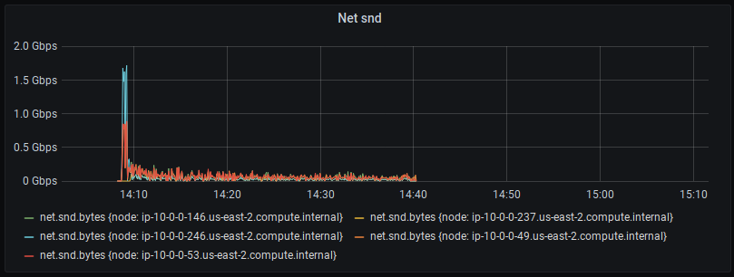
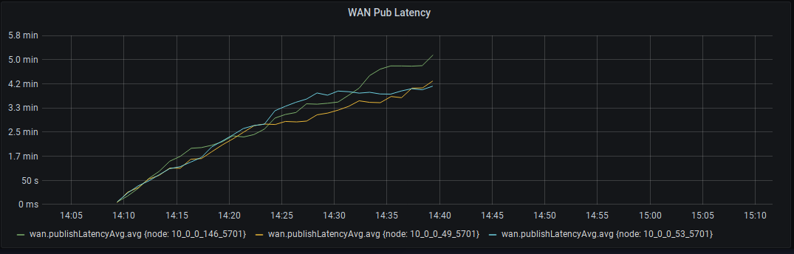

# WAN Replication 
> Tracked runs seen under tag `Group 11` at 
>[Runs Matrix](https://docs.google.com/spreadsheets/d/1ZXbXrnK9Pg-0NNjaHSza_xEwzw8PGxNajcdc9Vs89mg/edit?usp=sharing)
 
## Environment
AWS instances c5.9xlarge and Hazelcast 4.1 (master branch)
Tests done on a stable cluster with no ongoing migrations.

**Members**

- Total count 3
- Native In-Memory format
- Single Map


**Clients**

- Total count 5
- Client threads 32

## Report
The WAN feature allows end-users/customers, to replicate data across different clusters, in both ACTIVE/ACTIVE & ACTIVE/PASSIVE
scenarios. There are effectively two modes for WAN replication:

- `ACK_ON_OPERATION_COMPLETE`
- `ACK_ON_RECEIPT`

We did the initial testing with `ACK_ON_OPERATION_COMPLETE` mode. With the number of partitions set to 271, and two clusters,
one with 50% writes and 50% reads on a throughput mode benchmark, and the other on 100% reads on a throughput mode benchmark, 
results in very poor network utilization and big accumulation of events on the WAN queue. With an inappropriately capped queue it
results on an OOME[1] on the source cluster, and as expected with a capped queue, it results on dropped events.
The WAN settings are set to the default values, and the entry sizes on that single map we mainly operate on, is roughly 0.70 KB.

The network utilization peaks at around 1.5Gbps and then drops (in this case due to GC due to big capacity of the Queue) and as
expected the latency is increasing linearly.






[1] **OOME figure** 


Note: The maximum bandwidth available on the boxes is 10Gbps, with the maximum bandwidth across WAN members capped at 5Gbps 
(same placement group). 

It's worth mentioning, that no configuration change (eg. batch size, max-delay, etc) and no OS/Networking config changes 
(eg. buffer sizes) resulted in better/observable performance. The behavior is the same.
The most likely interpretation of the results is that we are not utilizing the network in the best possible way, while we wait 
for the invocation on the target to complete, causing the accumulation on the source side. 
This is further confirmed when we switch to the other mode of replication `ACK_ON_RECEIPT`,

On this mode, and while we are still at 271 partitions, the replication-link is more actively occupied and the replication follows
the map changes till the end of the benchmark, without any need of a full-sync. 


The WAN Queue is maintaining a healthy occupancy, and the publishing latency is at sub-second figures.


There were no changes between the two runs other than the ACK mode. Entry sizes stayed the same and all other config values as well.
If we increase the pressure on the target side, either by more clients on that side or by more sync-events on the source side, 
the wan throttling kicks in and appears to perform pretty well on keeping the target cluster healthy. 
This also results on accumulation on the source cluster queues, which similarly, can either be capped or OOME.

----

We now use the `ACK_ON_RECEIPT` as the mode of choice due to its behavior, and attempt to increase the partition count
up-to 50K partitions. Every change to the partition count shows degradation of performance, mainly due to GC pressure on the WAN
queue. The TPS of the test hasn't changed, and with partition counts even as high as 5K we can cause an OOME on the source side.
Partition counts up-to 2K, are *almost* stable (with some dives due to GC pauses)and the publishing latency is steadily increasing
with larger partition counts. The root cause of this accumulation is hard to pin-point without further metrics, but there is a
candidate to consider.

### Backup removals
During finalization of a Wan Event Replication, we remove the backup operations. To do so we trigger invocations for each
partition owner of the individual backups 
see. `com.hazelcast.enterprise.wan.impl.replication.AbstractWanPublisher.invokeBackupRemovalOperations`
When the partition count increases, the invocation count increases too, and till the invocations complete, the code blocks from
any further progress. We don't have runs with finer resolution on metrics to visualize this behavior, but some flame-charts show 
the additional time spent when partition count increases.

Here is a screen when we have 271 partitions:


Here is another screen when we increase to 2K partitions:  


*The mouse pointer, points to the frame of interest.*

This stall in the publisher, can easily allow the queue occupancy to grow out of control, causing the GC to choke and eventually
OOME the box.

## Other considerations

### Config
Let's look at the configuration used to manipulate WAN replication, which is as follows:

```xml
<batch-publisher>
    <cluster-name>...</cluster-name>
    <publisher-id>...</publisher-id>
    <batch-size>1000</batch-size>
    <batch-max-delay-millis>2000</batch-max-delay-millis>
    <response-timeout-millis>60000</response-timeout-millis>
    <acknowledge-type>ACK_ON_OPERATION_COMPLETE</acknowledge-type>
    <initial-publisher-state>REPLICATING</initial-publisher-state>
    <snapshot-enabled>false</snapshot-enabled>
    <idle-max-park-ns>250000000</idle-max-park-ns>
    <idle-min-park-ns>10000000</idle-min-park-ns>
    <max-concurrent-invocations>-1</max-concurrent-invocations>
    <discovery-period-seconds>10</discovery-period-seconds>
    <use-endpoint-private-address>false</use-endpoint-private-address>
    <queue-full-behavior>DISCARD_AFTER_MUTATION</queue-full-behavior>
    <max-target-endpoints>2147483647</max-target-endpoints>
    <queue-capacity>10000</queue-capacity>
    <target-endpoints>...</target-endpoints>
    <sync>
        <consistency-check-strategy>NONE</consistency-check-strategy>
    </sync>
</batch-publisher>
```

There are a few interesting problems with the options available in the config.
It seems quiet advanced, presumably trying to give extra flexibility to the user, but in reality its very complex and hard to get
right. As a user when I am given options to optimize the behaviour of a subsystem, I expect my choices to be predictable.
During the benchmark phases, I was pretty much unable to deduce good options for the configuration variables to get better
performance behavior.

After some discussions with Zoltan, I came to the conclusions that the figures related to the batch sizing and delays, 
could be powerful, but they can't be static. These should ideally be dynamic variables adapting at the cluster & networking performance
of the environment. They heavily depend on the network latency, on the ACK response time and possibly to other metrics too.
Given that Hazelcast has now the ability to have separate sockets for WAN, it would be nice to consider an adaptive policy which
measures and adjusts this figure on-the-fly. We could still offer the flexibility to the power users to control them via properties
or even just leave this control to the SPI.

One further argument against the `queue-capacity` config, is that it means one thing when entry sizes are 1KB and a another thing
when they are 10KB. We should ideally be relying on heap utilization (if we stay ON heap) rather than entry counts. At the very
least we should provide both and use a policy of whichever invariant we cross first.

### Event Journal

Last but not least, in the context of large cluster, we are very tightly coupled with JVM heap constraints. On an environment
with potentially high latencies (ie. different DCs) is problematic to rely on heap structures that can either limit the amount
of buffer we can have or cause OOME.
We should consider off heap event journals to relief any GC pressure from the JVM and allow for even bigger buffers, minimizing
the need for full syncs at all costs. This is a fundamental change of course, but WAN is one of the most used EE features.